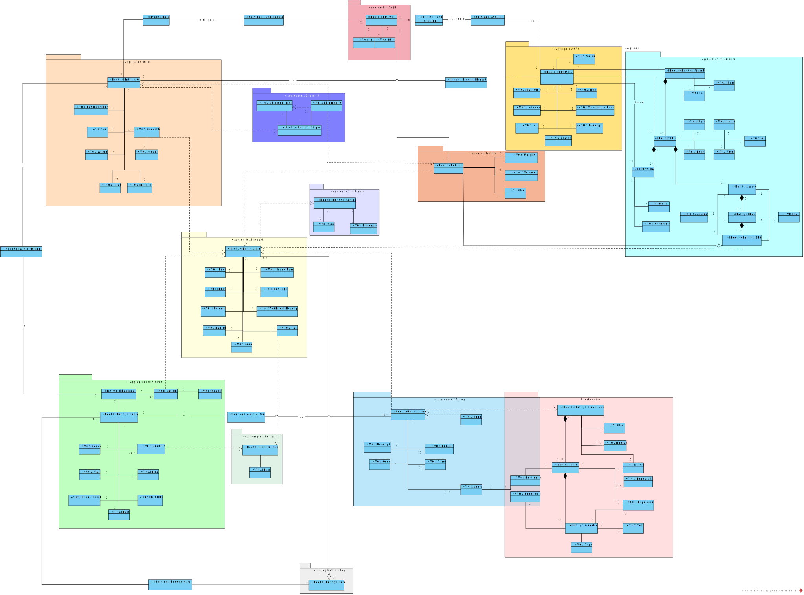

#README - Sprint 2

##1. Group Members

| Number  |        Name        |
|:-------:|:------------------:|
| 1190827 |    Luís Araújo     |
| 1201180 | Guilherme Sencadas |
| 1201216 |  Lucas Guimarães   |
| 1201217 |    Marco Ramos     |
| 1201228 |   Ana RIta Silva   |

##2. Tasks
 
###2.1 Task Division
| Task Number |                                                                                                                                                                                                                 Description                                                                                                                                                                                                                 |
|:-----------:|:-------------------------------------------------------------------------------------------------------------------------------------------------------------------------------------------------------------------------------------------------------------------------------------------------------------------------------------------------------------------------------------------------------------------------------------------:|
|    0004     |                                                                                                                                              *As **Project Manager**, I want the team to configure the project structure to facilitate / accelerate the development of upcoming user stories.*                                                                                                                                              |
|    1001     |                                                                                                                                                                                       *As **Sales Clerk**, I want to specify a new product for sale.*                                                                                                                                                                                       |
|    1002     |                                                                                                                                                                                     *As **Sales Clerk**, I want to view/search the products' catalog.*                                                                                                                                                                                      |
|    1003     |                                                                                                                                                                                          *As **Sales Clerk**, I want to register a new customer.*                                                                                                                                                                                           |
|    1004     |                                                                                                                                                                         *As **Sales Clerk**, I want to create a new products order on behalf of a given customer.*                                                                                                                                                                          |
|    1005     |                                                                                                                                                                                     *As **Sales Clerk**, I want to define a new category of products.*                                                                                                                                                                                      |
|    1900     |                                                                                             *As **Project Manager,** I intend that, for demonstration purposes, the system has the possibility of being initialized (bootstrap) with some information related to the product catalog and auxiliary information (e.g., categories of products).*                                                                                             |
|    2001     |                                                                                                                                                                         *As **Warehouse Employee**, I want to set up the warehouse plant by uploading a JSON file.*                                                                                                                                                                         |
|    2002     |                                                                                                                                                                            *As **Warehouse Employee**, I want to configure the AGVs available on the warehouse.*                                                                                                                                                                            |
|    9001     | *As software product **client**, I want the team (software product supplier) to prepare a presentation focusing on the following aspects:   (i) main objectives of the system; (ii) adopted development process and planning; (iii) teamwork methodology and conflict resolution strategy; (iv) product quality;(v) expected results; (vi) 'turnkey' format for software delivery/sale; among others relevant aspects.* “ |

###1.2 Task Attribution
|           Task Number            | Member  |    Member Name     | Inputs                                                                                                                                                                                                                                                                                              |
|:--------------------------------:|:-------:|:------------------:|-----------------------------------------------------------------------------------------------------------------------------------------------------------------------------------------------------------------------------------------------------------------------------------------------------|
|               0004               | 1201217 |    Marco Ramos     | (none)                                                                                                                                                                                                                                                                                              |
|     [1001](US1001/US1001.md)     | 1190827 |    Luís Araújo     | <li>2. Specify a new product  <li> 1  <li> Code1  <li> SD1  <li> ED12345678987654321234  <li> TD1  <li> path  <li> 111  <li> B1  <li> R1  <li> 15.0  <li> 10.0  <li> 1  <li> 1  <li> 1  <li> 10.0  <li> 10.0  <li> 10.0  <li> 10.0  <li> 1  <li> n |
|     [1002](US1002/US1002.md)     | 1190827 |    Luís Araújo     | <li>3. View Catalog  <li> 1  <li> 1                                                                                                                                                                                                                                                         |
|     [1003](US1003/US1003.md)     | 1201216 |  Lucas Guimarães   | <li>1. Create Customer  <li>Jose Rodriguez <li> 123456789  <li> pr@gmail.com <li> +351 <li> 123456789  <li> y -> male <li> y -> rua Santa Catarina -> 73 -> 1234-1234 -> Atlanta -> Portugal  <li> n  <li>n                                                     |
|               1004               | 1201217 |    Marco Ramos     |                                                                                                                                                                                                                                                                                                     |
|     [1005](US1005/US1005.md)     | 1201228 |   Ana Rita Silva   | <li>5.Create a Category  <li> 123aa  <li>  This category has chairs.                                                                                                                                                                                                                        |
|     [1900](US1900/US1900.md)     | 1201180 | Guilherme Sencadas |                                                                                                                                                                                                                                                                                                     |
|     [2001](US2001/US2001.md)     | 1201228 |   Ana Rita Silva   | <li>2.Set up the warehouse plant  <li> Path to the file                                                                                                                                                                                                                                         |
|               2002               | 1201216 |  Lucas Guimarães   |                                                                                                                                                                                                                                                                                                     |
| [9001](US9001/Presentation.pptx) | 1201180 | Guilherme Sencadas | (none)                                                                                                                                                                                                                                                                                              |

##3. Documentation

###3.1 Domain Model

##3. Annotations

None