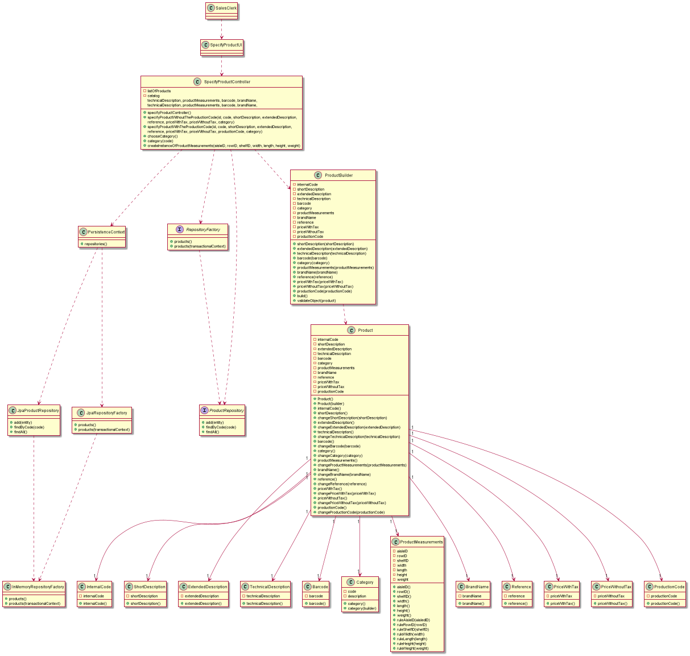

# US1001  
=======================================

# 1. Requirements

####Description:
>As Sales Clerk, I want to specify a new product for sale.

###Client Clarifications:

* >**Q:** Can the Product be a part of a Super Category and a Category or will the Product be a part of a Category and that Category is a part of the Super Category?
    
  >**A:** By simplicity, a category consists only of an alphanumeric code, and a description. Each product belongs mandatorily to a single category.
  As so, and contrary to what is suggested in your question, there is no hierarchy between categories.
  > 
  >  [Link to forum](https://moodle.isep.ipp.pt/mod/forum/discuss.php?d=15693)

* >**Q:** Regarding the barcode of a given product what should the coding standard be?
    
  > **A:** Any of the supported standards. It might be set by configuration at system implantation time.
  > 
  >  [Link to forum](https://moodle.isep.ipp.pt/mod/forum/discuss.php?d=15753)

* >**Q:** Still regarding the barcode should the identifier be sequential, if not what method should we use to generate the identifier?
    
  > **A:** Barcodes are manually introduced by users since each product barcode is provided by the product manufacture.
  > 
  >  [Link to forum](https://moodle.isep.ipp.pt/mod/forum/discuss.php?d=15753)

* >**Q:** It was mentioned in a previous question that both the production code and the internal code have a set regular expression, could an example of said regular expressions be given?
    
  > **A:** For example, 4 letters followed by a dot (".") and ending with 5 digits.
  > 
  >  [Link to forum](https://moodle.isep.ipp.pt/mod/forum/discuss.php?d=15753)

* >**Q:** Can the regular expression be changed by an employee, if so which one?
    
  > **A:** No! Such regular expressions are set by configuration at system implantation time.
  >
  >  [Link to forum](https://moodle.isep.ipp.pt/mod/forum/discuss.php?d=15753)

* >**Q:** Regarding the barcode of the product should an image be generated or only the code be saved?
    
  > **A:** No image is required to be generated.
  >
  >  [Link to forum](https://moodle.isep.ipp.pt/mod/forum/discuss.php?d=15843)

* >**Q:** Regarding the measures of the product(column, weight) what are the units of measurement that should be supported?
      
    > **A:** Millimeters. The width, length and height of a product is specified in millimeters; the weight of the product is specified in grams.
    >
  >  [Link to forum](https://moodle.isep.ipp.pt/mod/forum/discuss.php?d=15843)

* >**Q:** Are the internal code, production code and reference generated or entered?
        
      > **A:** That information is all entered/typed by the user.
      >
  >  [Link to forum](https://moodle.isep.ipp.pt/mod/forum/discuss.php?d=15877)

* >**Q:** About the photo in the product, we would like to know how it is associated to the product. Should we write the path to it, or should a window open to import the photo into the program?
        
      > **A:** From a usability perspective, it would be better having a window (or any other way) to select the photo file to be uploaded.
      > 
  >  [Link to forum](https://moodle.isep.ipp.pt/mod/forum/discuss.php?d=15900)
 
* >**Q:** The development team wonders what attributes of the product may differ per unit, i.e. from unit 1 and unit 2 of product A what may be different?
        
      > **A:** For simplicity, consider that there is no distinct attributes per product unit (e.g.: serial number).
  >  [Link to forum](https://moodle.isep.ipp.pt/mod/forum/discuss.php?d=15968)

* >**Q:** Given that all the units of a product are located in a single warehouse, should in the moment of creation of the product the sales clerk chose one of the available? If so should it indicate the aisle, row and shelf, where the products are located?
        
      > **A:**
      Yes, the product location might be specified during US 1001.
      > 
  >  [Link to forum](https://moodle.isep.ipp.pt/mod/forum/discuss.php?d=15970)
 
* >**Q:** Inside of a row should products of the same "id" or they can be different types of products inside the row? If every row has one "id" type of product will simplify things.
        
      > **A:** I believe that it is clear that on the same row might exist different types of products. For instance, if the row is split on two shelves, on one shelf might store units of product A while the other shelf might store units of product B.
  >  [Link to forum](https://moodle.isep.ipp.pt/mod/forum/discuss.php?d=15971)
 
* >**Q:** When creating a new Product, what Currency should we use?
        
      > **A:** The system should work adopting a base currency (e.g.: EUR) and, according to the customer location, be able to present prices on other currencies (e.g. USD) using an external currency converter.
      > 
  >  [Link to forum](https://moodle.isep.ipp.pt/mod/forum/discuss.php?d=15973)
  >  [Link to forum](https://moodle.isep.ipp.pt/mod/forum/discuss.php?d=15740#p20253)

* >**Q:** Is a product's availability related to wether they are in shelves or not? By that i mean, can a product be available even thought it isn't in a shelf or are they by default unavailable.
        
      > **A:** In the scope of this prototype, you may consider that products are always available (no stock management is required).
      >
  >  [Link to forum](https://moodle.isep.ipp.pt/mod/forum/discuss.php?d=16047)

# 2. Analysis

*In this section the team should describe the study/analysis/comparison done with the meaning to take the best options
of design for the functionality as well as apply the suited diagrams/artifacts of analysis.*

*It is recommended to organize the content by subsections.*

## 2.1. System Sequence Diagram (SSD)

# 3. Design

*In this section the team should describe the adopted design to satisfy the functionality. Among others, the team should
present the functionality development diagram(s), class diagram(s), identification of patterns applied and which were the
principal tests specified to validate the functionality.*

*Beyond the suggested sections, others can be included.*

## 3.1. Functionality development

*In this section should be presented and described the flow/sequence that allows to run the functionality.*

To execute this user story the following steps are required:
- Login as sales clerk
- Select options
- Select "Specify a new product"
- Choose the category of the product
- Insert all the data of the product

## 3.2. Class Diagram

*In this section should be presented and described the main classes involved in the functionality development.*

## 3.3. Sequence Diagram

## 3.4. Applied patterns

*In this section show be presented and explained which were the design patterns applied and the best practices.*

The following design patterns were used in this user story:
- Builder

## 3.4. Tests
*In this section should be systemized how the tests were developed to allow a correct way to scout the requirement satisfaction.*

**Test 1:** Verifying the business rules of Code

    @Test
    void internalCode() {
        //Assert
        assertEquals("Code1", product.internalCode().internalCode());
    }

**Test 2:** Verifying the business rules of shortDescription

    @Test
    void shortDescription() {
        //Assert
        assertEquals("shortDescription", product.shortDescription().shortDescription());
    }

**Test 3:** Verifying the business rules of extendedDescription

    @Test
    void extendedDescription() {
        //Assert
        assertEquals("shortDescription", product.shortDescription().shortDescription());
    }

**Test 4:** Verifying the business rules of technicalDescription

    @Test
    void technicalDescription() {
        //Assert
        assertEquals("shortDescription", product.shortDescription().shortDescription());
    }

**Test 5:** Verifying the business rules of barcode

    @Test
    void barcode() {
        //Assert
        assertEquals("shortDescription", product.shortDescription().shortDescription());
    }

**Test 6:** Verifying the business rules of productMeasurements

    @Test
    void productMeasurements() {
        //Arrange
        ProductMeasurements aux = new ProductMeasurements(2, 1, 1, 10.0, 10.0, 10.0, 10.0);

        //Assert
        assertNotEquals(aux, product.productMeasurements());
    }

**Test 7:** Verifying the business rules of brandName

    @Test
    void brandName() {
        //Assert
        assertEquals("brandName", product.brandName().brandName());
    }

**Test 8:** Verifying the business rules of reference

    @Test
    void reference() {
        //Assert
        assertEquals("reference", product.reference().reference());
    }

**Test 9:** Verifying the business rules of priceWithTax

    @Test
    void priceWithTax() {
        //Assert
        assertEquals(11.0, product.priceWithTax().priceWithTax());
    }

**Test 10:** Verifying the business rules of priceWithoutTax

    @Test
    void priceWithoutTax() {
        //Assert
        assertEquals(10.0, product.priceWithoutTax().priceWithoutTax());
    }

**Test 11:** Verifying the business rules of productionCode

    @Test
    void productionCode() {
        //Assert
        assertEquals("PC1", product2.productionCode().productionCode());
    }

# 4. Implementation

*In this section the team show provide, if necessary, some evidence that the implementation is in accordance with the design developed.
Beyond that, show be mentioned/described the existence of any other relevant file (e.g. configuration) e highlight relevant commits.*

*It is recommended to organize this content in subsections.*

# 5. Integration/Demonstration

*In this section the team should describe the efforts made to integrate the developed functionality with the remaining functionality of the system.*

# 6. Observations

*In this section is suggested to present a critic view about the pointed developed work, for example, other ways and/or future works related.*