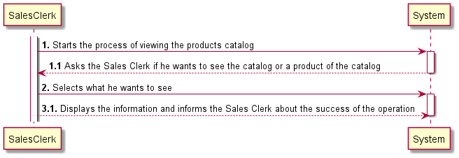
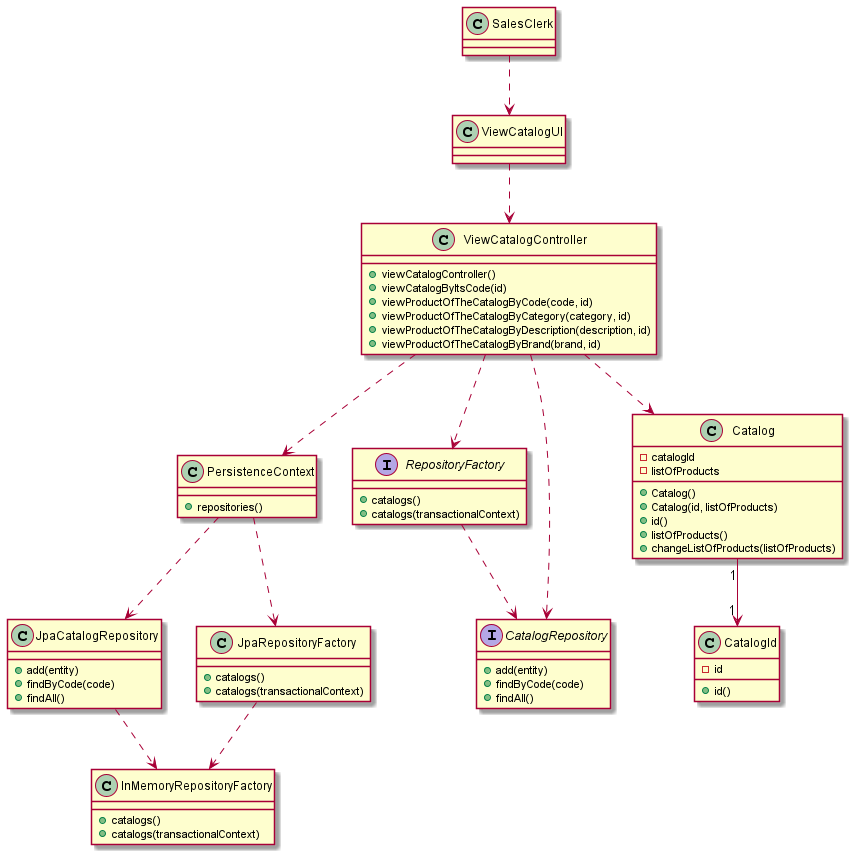

# US1001
=======================================

# 1. Requirements

####Description:
>As Sales Clerk, I want to view/search the products catalog.

###Client Clarifications:

* >**Q:** Regarding the product search, is there a field you want to use to filter the data and any desired data presentation order? And do you want to see all the fields or just a simplified summary?
    
  >**A:**
  Commonly fields used to filter products are:Category; Description (any of the available descriptions); Brand. User should select/specify a data presentation order. This applies to any similar US. At least the product' code, short description, brand, category and unit price should be presented. More details can be presented for a given/selected product at user request.
  >
  >  [Link to forum](https://moodle.isep.ipp.pt/mod/forum/discuss.php?d=15690)

* >**Q:** Should the sales clerk select/specify the catalog presentation order before he/she can see the catalog? Or the catalog is presented in a default order, and then if the sales clerk wants, he/she can change it? The same doubt came on the filtering.
    
  > **A:** Data to be used to filter the products catalog content should be asked ahead.
  >
  >  [Link to forum](https://moodle.isep.ipp.pt/mod/forum/discuss.php?d=15745)

* >**Q:** Talking about data presentation orders, which ones should exist?
    
  > **A:** Regarding presentation order, the necessary data can be asked either: ahead and after presenting them.
  >
  >  [Link to forum](https://moodle.isep.ipp.pt/mod/forum/discuss.php?d=15745)

# 2. Analysis

*In this section the team should describe the study/analysis/comparison done with the meaning to take the best options
of design for the functionality as well as apply the suited diagrams/artifacts of analysis.*

*It is recommended to organize the content by subsections.*

## 2.1. System Sequence Diagram (SSD)

# 3. Design

*In this section the team should describe the adopted design to satisfy the functionality. Among others, the team should
present the functionality development diagram(s), class diagram(s), identification of patterns applied and which were the
principal tests specified to validate the functionality.*

*Beyond the suggested sections, others can be included.*

## 3.1. Functionality development

*In this section should be presented and described the flow/sequence that allows to run the functionality.*

To execute this user story the following steps are required:
- Login as sales clerk
- Select options
- Select "View Catalog"
- Select one of the options: view all the catalog or a product of the catalog

## 3.2. Class Diagram

*In this section should be presented and described the main classes involved in the functionality development.*

## 3.3. Sequence Diagram

## 3.4. Applied patterns

*In this section show be presented and explained which were the design patterns applied and the best practices.*

The following design patterns were used in this user story:
- Builder

## 3.4. Tests
*In this section should be systemized how the tests were developed to allow a correct way to scout the requirement satisfaction.*

**Test 1:** Verifying the business rules of listOfProducts

	@Test
    void listOfProducts() {
        //Arrange
        List<Product> aux = new ArrayList<>();
        aux.add(product);
        aux.add(product2);

        //Assert
        assertEquals(aux, catalog.listOfProducts());
    }

**Test 2:** Verifying the business rules of catalogId

	@Test
    void catalogId() {
        //Assert
        assertEquals(1L, catalog.id().id());
    }

# 4. Implementation

*In this section the team show provide, if necessary, some evidence that the implementation is in accordance with the design developed.
Beyond that, show be mentioned/described the existence of any other relevant file (e.g. configuration) e highlight relevant commits.*

*It is recommended to organize this content in subsections.*

# 5. Integration/Demonstration

*In this section the team should describe the efforts made to integrate the developed functionality with the remaining functionality of the system.*

# 6. Observations

*In this section is suggested to present a critic view about the pointed developed work, for example, other ways and/or future works related.*