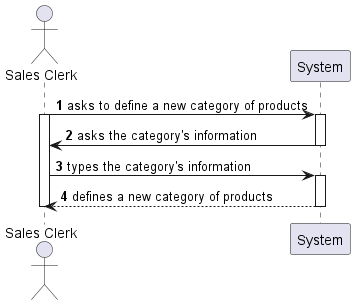
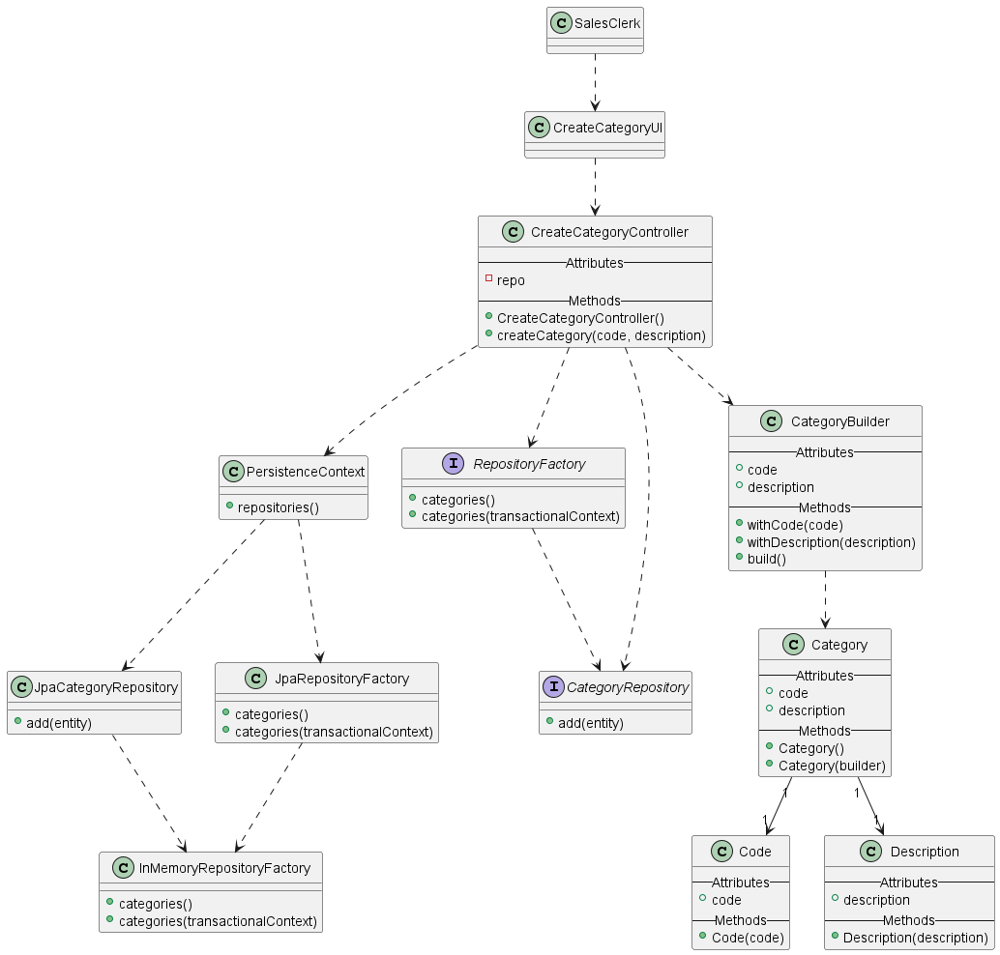
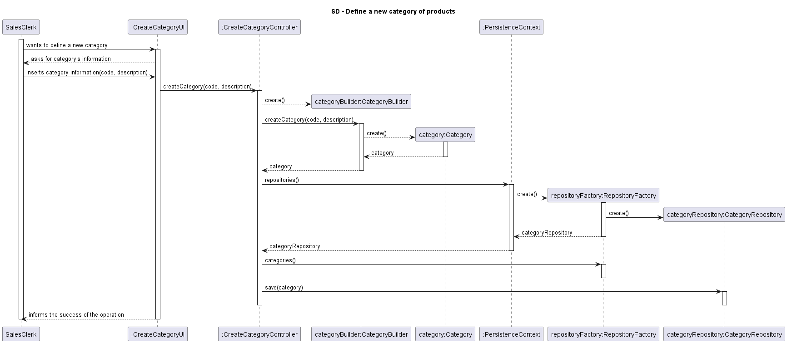

US1005
=======================================

# 1. Requirements

*In this section the team should indicate the developed functionality as well as describe its interpretation and its
correlation and/or dependency of/with others requirements.*

## 1.1. User Story Description and Interpretation

**US1005:** “As Sales Clerk, I want to define a new category of products.“

## 1.2. Customer Specifications and Clarifications

- Question: "When creating a new product category, is it supposed to be able to add products at the moment of the creation? Or just after the category is created?"

  - Answer: "No, it is not supposed to add products while creating the category."
      [Link 1](https://moodle.isep.ipp.pt/mod/forum/discuss.php?d=15967#p20520)
  

- Question: "In this forum post you said that there is no hierarchy between categories [Link 3](https://moodle.isep.ipp.pt/mod/forum/discuss.php?d=15693). 
But in the project description it's said that there is an optional reference to a super-category(Section 3.1).
Could you please clarify if it is possible to a category have a reference to another category? (super-category)."
  - Answer: "For now, there is no need of hierarchies on categories."
    [Link 2](https://moodle.isep.ipp.pt/mod/forum/discuss.php?d=15796#p20298)

- Question: "Is there any rules for the alphanumeric code, or the Sales Clerk chooses what to input?"
  - Answer: "There are some basic rules:   &emsp;- code: not empty alphanumeric code with at 10 chars maximum; &emsp;-
  description: not empty with a minimum of 20 chars and 50 chars maximum;"
    [Link 4](https://moodle.isep.ipp.pt/mod/forum/discuss.php?d=15987)

# 2. Analysis

*In this section the team should describe the study/analysis/comparison done with the meaning to take the best options
of design for the functionality as well as apply the suited diagrams/artifacts of analysis.*

*It is recommended to organize the content by subsections.*

## 2.1. System Sequence Diagram (SSD)

# 3. Design

*In this section the team should describe the adopted design to satisfy the functionality. Among others, the team should
present the functionality development diagram(s), class diagram(s), identification of patterns applied and which were the
principal tests specified to validate the functionality.*

*Beyond the suggested sections, others can be included.*

## 3.1. Functionality development

*In this section should be presented and described the flow/sequence that allows to run the functionality.*

To execute this user story the following steps are required:
- Login as sales clerk
- Select options
- Select "Create a new category."
- Insert the category's code
- Insert the category's description

## 3.2. Class Diagram

*In this section should be presented and described the main classes involved in the functionality development.*

## 3.3. Sequence Diagram

## 3.4. Applied patterns

*In this section show be presented and explained which were the design patterns applied and the best practices.*

The following design patterns were used in this user story:
- Builder

## 3.4. Tests
*In this section should be systemized how the tests were developed to allow a correct way to scout the requirement satisfaction.*

**Test 1:** Verifying the business rules of Code

	@Test
    void blankCodeTest() {
        Exception exception = assertThrows(IllegalArgumentException.class, () -> new Code(""));
        assertEquals("Code should be alphanumeric, not null nor empty.", exception.getMessage());
    }

**Test 2:** Verifying the business rules of Description

	@Test
    void tooShortDescriptionTest() {
        Exception exception = assertThrows(IllegalArgumentException.class, () -> new Description("11aa"));
        assertEquals("Description should have a minimum of 20 chars and 50 chars maximum.", exception.getMessage());
    }

# 4. Implementation

*In this section the team show provide, if necessary, some evidence that the implementation is in accordance with the design developed.
Beyond that, show be mentioned/described the existence of any other relevant file (e.g. configuration) e highlight relevant commits.*

*It is recommended to organize this content in subsections.*

# 5. Integration/Demonstration

*In this section the team should describe the efforts made to integrate the developed functionality with the remaining functionality of the system.*

# 6. Observations

*In this section is suggested to present a critic view about the pointed developed work, for example, other ways and/or future works related.*