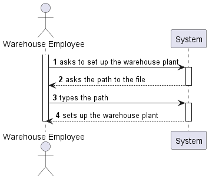

US2001
=======================================

# 1. Requirements

*In this section the team should indicate the developed functionality as well as describe its interpretation and its
correlation and/or dependency of/with others requirements.*

## 1.1. User Story Description and Interpretation

**US2001:** "As Warehouse Employee, I want to set up the warehouse plant by uploading a JSON file."

**Acceptance Criteria:** "A pre-defined JSON file can be automatically upload (e.g. at application start-up) to get a default
warehouse plant and avoiding the employee to execute this action."

This user story was divided in the following steps:

- Upload JSON file
- Define a default warehouse plant
- Let the employee change the current plant

## 1.2. Customer Specifications and Clarifications

- Question: "Does a warehouse always have the same plant or can it have different plants in the future?"

  - Answer: "Each warehouse has its own plant and, therefore, plants might vary from one warehouse to another. However, any
  warehouse plant is described by a JSON file according to the data structure described in section 5.2 of the
  specifications' document. On US2001, any JSON file meeting such data structure must be supported."
    [Link 1](https://moodle.isep.ipp.pt/mod/forum/discuss.php?d=8857#p11584)

- Question: "Regarding the shelves in each row that are part of an aisle, is there a need to differentiate them? If not,
how will the AGV know on which shelf to look for a product? Because, as we understood, different products can be placed
on a different shelf of the same row, and according to the JSON file provided, each row only states how many shelves it has."
  - Answer: "Yes! You need to differentiate the shelves in each row of an aisle. Recall that "The products’ location in the
  warehouse, which corresponds to a storage area i.e., the aisle identifier, the row identifier, and the shelf identifier.
  All these identifiers are numeric." As you have noticed, each row states how many shelves it has. As so, if a row states
  it has 4 shelves, it means that the row shelves are identified as shelf 1, 2, 3 and 4 from the bottom to the top. If another row
  stated it has 3 shelves, it means that such row shelves are identified as shelf 1, 2 and 3 again from the bottom to the top."
    [Link 2](https://moodle.isep.ipp.pt/mod/forum/discuss.php?d=15758#p20252)

- Question: "Regarding the upload of a JSON file, is that file supposed to be stored with the rest of the application and be
uploaded every time the application runs or should the upload be done only once where the information would all be uploaded to
the application database and the JSON file discarded/not stored?"
  - Answer: "The purpose of uploading a JSON file (US2001) is to set up the warehouse plant information required to the system work properly.
Once that information is set up, there is no need to repeat the set up process. As so, if a JSON file is found the user might be prompt if (s)he wants to update the information about the warehouse plant. The user might also update the information by re-executing the US2001.
Yet, it is worth noticing that the JSON file might not be available on all workstations used by warehouse employees.
As so, persisting warehouse plant data on the database seems to be a good option."
    [Link 3](https://moodle.isep.ipp.pt/mod/forum/view.php?id=93680)

# 2. Analysis

*In this section the team should describe the study/analysis/comparison done with the meaning to take the best options
of design for the functionality as well as apply the suited diagrams/artifacts of analysis.*

*It is recommended to organize the content by subsections.*

## 2.1. System Sequence Diagram (SSD)

# 3. Design

*In this section the team should describe the adopted design to satisfy the functionality. Among others, the team should
present the functionality development diagram(s), class diagram(s), identification of patterns applied and which were the
principal tests specified to validate the functionality.*

*Beyond the suggested sections, others can be included.*

## 3.1. Functionality development

*In this section should be presented and described the flow/sequence that allows to run the functionality.*

## 3.2. Class Diagram

*In this section should be presented and described the main classes involved in the functionality development.*

## 3.3. Applied patterns

*In this section show be presented and explained which were the design patterns applied and the best practices.*

## 3.4. Tests
*In this section should be systemized how the tests were developed to allow a correct way to scout the requirement satisfaction.*

**Test 1:** Bla Bla Bla

	@Test(expected = IllegalArgumentException.class)
		public void ensureNullIsNotAllowed() {
		Exemplo instance = new Exemplo(null, null);
	}

# 4. Implementation

*In this section the team show provide, if necessary, some evidence that the implementation is in accordance with the design developed.
Beyond that, show be mentioned/described the existence of any other relevant file (e.g. configuration) e highlight relevant commits.*

*It is recommended to organize this content in subsections.*

# 5. Integration/Demonstration

*In this section the team should describe the efforts made to integrate the developed functionality with the remaining functionality of the system.*

# 6. Observations

*In this section is suggested to present a critic view about the pointed developed work, for example, other ways and/or future works related.*