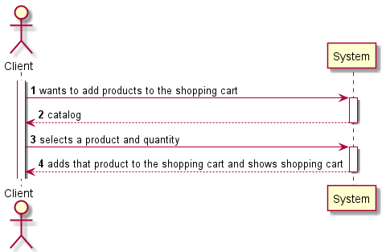
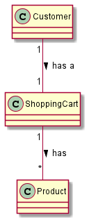
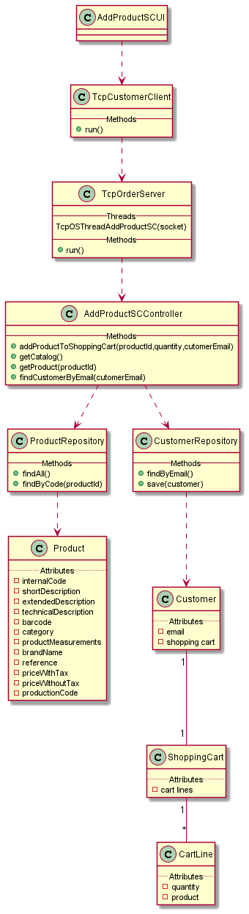
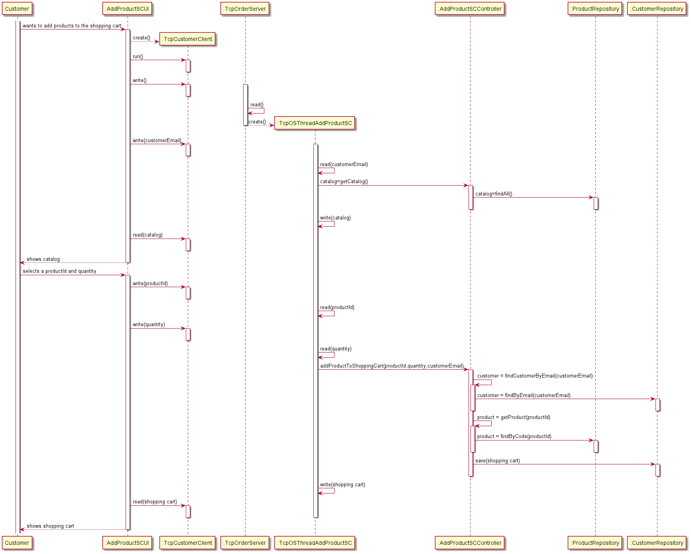

# US1501
=======================================

# 1. Requirements

#### Description:

> As Customer, I want to view/search the product catalog and be able to add a product to the shopping cart.

###### Acceptance Criteria:

> It is mandatory using the "OrdersServer" component (cf. US1901).

### Project Clarifications:

* > Another console application, called “Customer Application”, suitable for the customer needs. This application will be installed/running on the customers personal computers, not managed by the company. For that reason, a direct connection to the database (graphically depicted on red) must be avoid. Instead, data requests should be made through the “Orders API” exposed by the “Orders Server” component.

* > A server application, called “Orders Server”, responsible to fulfill the all the data requests necessary to the “Customer Application” works properly. The set of available/possible requests must be minimized and, each one, should have a very specific purpose (e.g.: add a product to the shopping cart, check the status of his/her open orders).

### Client Clarifications:

* > **Q:**
  > I hope your day is going well. Our team would like to now if anything said by you in these previous clarifications related to the US1002 are still valid for the US1501 having in consideration that now is the Client using the system and not a Clerk.

  >https://moodle.isep.ipp.pt/mod/forum/discuss.php?d=15745

  >https://moodle.isep.ipp.pt/mod/forum/discuss.php?d=16092

  >https://moodle.isep.ipp.pt/mod/forum/discuss.php?d=15690

  >Would anything change between to two user interfaces when searching the catalog and adding to the shopping cart?
    
  > **A:**
  > I have not found anything on those links that does not apply to US 1501.

  >However, and contrary to US1002, you should notice that on US1501 the user has the ability to add products to his/her shopping cart.
  >
  >  [Link to forum](https://moodle.isep.ipp.pt/mod/forum/discuss.php?d=16584#p21296)

# 2. Analysis

*In this section the team should describe the study/analysis/comparison done with the meaning to take the best options
of design for the functionality as well as apply the suited diagrams/artifacts of analysis.*

*It is recommended to organize the content by subsections.*

# 3. Design

*In this section the team should describe the adopted design to satisfy the functionality. Among others, the team should
present the functionality development diagram(s), class diagram(s), identification of patterns applied and which were
the principal tests specified to validate the functionality.*

*Beyond the suggested sections, others can be included.*

## 3.1. Functionality development

*In this section should be presented and described the flow/sequence that allows to run the functionality.*

## 3.2. Class Diagram

*In this section should be presented and described the main classes involved in the functionality development.*

## 3.3. Applied patterns

*In this section show be presented and explained which were the design patterns applied and the best practices.*

## 3.4. Tests

*In this section should be systemized how the tests were developed to allow a correct way to scout the requirement
satisfaction.*

**Test 1:** Bla Bla Bla

	@Test(expected = IllegalArgumentException.class)
		public void ensureNullIsNotAllowed() {
		Exemplo instance = new Exemplo(null, null);
	}

# 4. Implementation

*In this section the team show provide, if necessary, some evidence that the implementation is in accordance with the
design developed. Beyond that, show be mentioned/described the existence of any other relevant file (e.g. configuration)
e highlight relevant commits.*

*It is recommended to organize this content in subsections.*

# 5. Integration/Demonstration

*In this section the team should describe the efforts made to integrate the developed functionality with the remaining
functionality of the system.*

# 6. Observations

*In this section is suggested to present a critic view about the pointed developed work, for example, other ways and/or
future works related.*