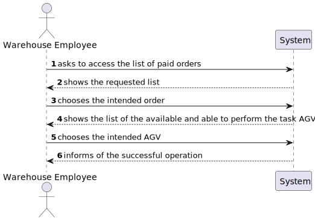

US2003
=======================================

# 1. Requirements

*In this section the team should indicate the developed functionality as well as describe its interpretation and its
correlation and/or dependency of/with others requirements.*

## 1.1. User Story Description and Interpretation

**US2003:** “As Warehouse Employee, I want to access the list of orders that need to be prepared by an AGV and be able to
ask/force any of those orders to be immediately prepared by an AGV available.“

**UC3.2.4b** "Assign a task/order to an AGV. Any order that has been paid represents a task that can be assigned to an AGV.
The task consists of picking up all the items of the respective order. The assignment of a task to an AGV can be done:
Manually by a warehouse employee. In this case, the employee identifies both the intended order and the intended AGV."

## 1.2. Customer Specifications and Clarifications

- Question: "Regarding US2003, the development team was wondering if the warehouse employee chooses the intended AGV available
to prepare the specific order or if it should be assigned to any AGV available without even asking the warehouse employee."

    - Answer: "In the scope of US 2003, the AGV is selected by the warehouse employee from the ones that are available and
  are able to perform the task."
      [Link 1](https://moodle.isep.ipp.pt/mod/forum/discuss.php?d=16270#p20884)

- Question: "Knowing that in US2003 it is only mentioned that the Warehouse Employee will do this action, I would like to
know if it is part of the System to allow users with greater skills and responsibilities (Warehouse Managers or Admins) to
also perform the same task? If yes, which users?"

    - Answer: "No! There is not such need."
      [Link 2](https://moodle.isep.ipp.pt/mod/forum/discuss.php?d=16291)

- Question: "Regarding this feature, what would you consider to be its complete state, that is, what would be the criterion
to define whether this feature was functional?"

    - Answer: "The warehouse employee is able to (i) select an order that needs to be prepared; (ii): select the AGV from
  the ones that are available and able to perform the task; (iii) the task is sent to the selected AGV and (iv) the order
  change its status."
      [Link 3](https://moodle.isep.ipp.pt/mod/forum/discuss.php?d=16290)
 

- Question: "It is mentioned that the warehouse is able to force a certain task to a certain AGV, but can this only happen
when the AGV is free, or can the warehouse employee cancel a task and assign a new one."

    - Answer: "In the scope of US 2003, the AGV is selected by the warehouse employee from the ones that are available and
are able to perform the task. Tasks cannot be manually cancelled."
      [Link 4](https://moodle.isep.ipp.pt/mod/forum/discuss.php?d=16270#p20884)

- Question: "What would be the minimum information needed to show the User in order to select the desired Order? From our
meeting the minimum result was the Identification , total Weight and Total Volume. Should we add something else?"

    - Answer: "I would say that from the warehouse employee point of view, it is useful to show the order id, the order
  date, the customer id/name and order total. The total weight and total volume might be also useful if (s)he knows the
  AGV' characteristics. However, it is up to the system ensure that the selected AGV is capable of fulfilling the task."
      [Link 5](https://moodle.isep.ipp.pt/mod/forum/discuss.php?d=16480#p21147)

## 1.2. Specifications Document Clarifications

- "The AGVs operating on the warehouse, its characteristics (e.g.: identifier, short description, model, and maximum
weight it can carry) and its base location (i.e., the AGV dock).  In addition, it is necessary to know the AGV status 
regarding its autonomy (e.g.: 2 hours left) and current task (e.g.: free, charging, occupied serving a given order)."

- "Any order that has been successfully paid is ready to be prepared by the warehouse. In case an AGV is free, and it has
the capacity to carry all the products order (regarding the order total volume and weight), such order can be assigned
(as a task) to the AGV."

 Considering the clarifications in the specifications document the development team decided to implement the "Task" concept,
however the implemented class was called "Status". This name was given because the development team thought it was more
enlightening and precise this way, given the fact besides associate an order with an AGV it also defines the current state 
of the AGV.

# 2. Analysis

*In this section the team should describe the study/analysis/comparison done with the meaning to take the best options
of design for the functionality as well as apply the suited diagrams/artifacts of analysis.*

*It is recommended to organize the content by subsections.*

## 2.1. System Sequence Diagram (SSD)

# 3. Design

*In this section the team should describe the adopted design to satisfy the functionality. Among others, the team should
present the functionality development diagram(s), class diagram(s), identification of patterns applied and which were the
principal tests specified to validate the functionality.*

*Beyond the suggested sections, others can be included.*

## 3.1. Functionality development

*In this section should be presented and described the flow/sequence that allows to run the functionality.*

To execute this user story the following steps are required:
- Login as Warehouse Employee
- Choose the intended order
- Choose the intended agv
- Order assigned successfully

## 3.2. Class Diagram

*In this section should be presented and described the main classes involved in the functionality development.*

## 3.3. Sequence Diagram

