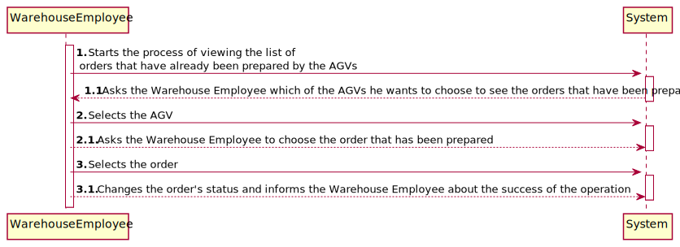
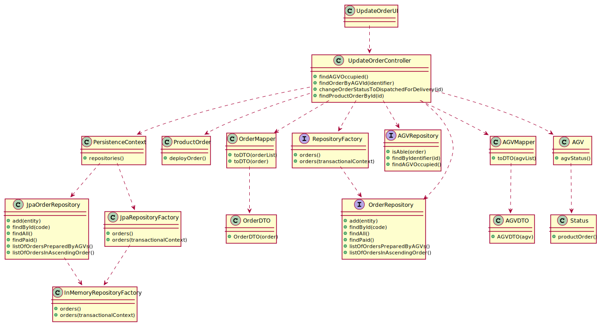
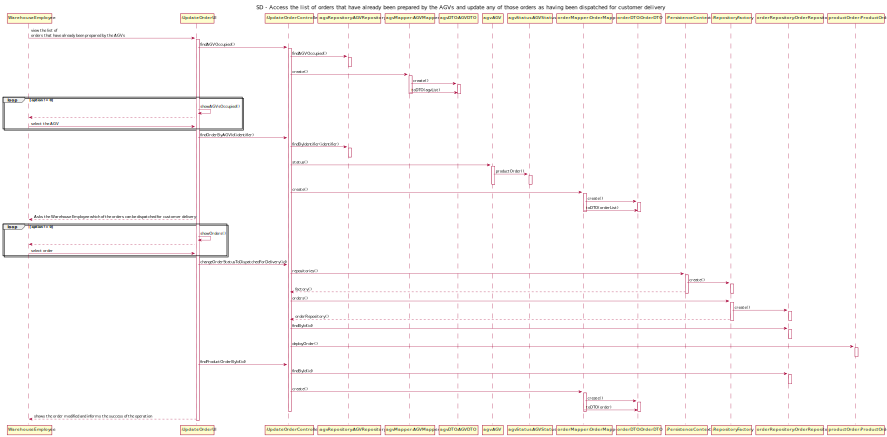

# US2004 - Access the list of orders that have already been prepared by the AGVs and update any of those orders as having been dispatched for customer delivery
=======================================

# 1. Requirements

## 1.1. User Story Description and Interpretation

#### Description:

> As Warehouse Employee, I want to access the list of orders that have already been prepared by the AGVs and be able to update any of those orders as having been dispatched for customer.

#### Acceptance Criteria

> Ability to filter the orders by the AGV that have collected those products.

## 1.2. Client Clarifications

### From Document

* > An order must be in the "<u>ready for packing</u>" state.

 

* > The warehouse employee <u>chooses</u> on of the orders.

 

* > The warehouse employee <u>informs the system that such work has been done</u>.

 

* > The warehouse employee can <u>filter the orders by the AGVs</u> that have collected those products.

 

### From Forum

* > **Q:** Regarding this feature, what would you consider to be its complete state, that is, what would be the criterion to define whether or not this feature was functional?
  >   
  > **A:** (...) the status of the selected order(s) changed from "already been prepared by the AGV" to "dispatched for customer delivery".
  >  [Link to forum](https://moodle.isep.ipp.pt/mod/forum/discuss.php?d=16330)

* > **Q:** "The ability to filter those order by the AGV that have collected those products is request." - What do you mean by filter by AGV? Filter by AGV name p.e.?
  >   
  > **A:** Orders, soon or later, will be assigned as tasks to AGVs operating on the warehouse (defined on US 2002). Some orders will be assigned, for instance, to "AGV A" while others to the "AGV XPTO" and so on...
  >   What is being requested is the ability to filter the presented orders by the AGV that has performed the respective task, i.e. to show the list of orders that have been prepared by a given AGVs.
  >  [Link to forum](https://moodle.isep.ipp.pt/mod/forum/discuss.php?d=16327)

# 2. Analysis

*In this section the team should describe the study/analysis/comparison done with the meaning to take the best options
of design for the functionality as well as apply the suited diagrams/artifacts of analysis.*

*It is recommended to organize the content by subsections.*

## 2.1. System Sequence Diagram (SSD)

# 3. Design

*In this section the team should describe the adopted design to satisfy the functionality. Among others, the team should
present the functionality development diagram(s), class diagram(s), identification of patterns applied and which were the
principal tests specified to validate the functionality.*

*Beyond the suggested sections, others can be included.*

## 3.1. Functionality development

*In this section should be presented and described the flow/sequence that allows to run the functionality.*

To execute this user story the following steps are required:
- Login as "warehouse employee"
- Select "Options"
- Select "Assign order to an AGV"
- Select the intended order
- Select the intended AGV
- Select "Options"
- Select "Update order to dispatched for customer delivery"
- Select one of the AGVs that has been preparing an order
- Select the order that has been prepared by the AGV

## 3.2. Class Diagram

*In this section should be presented and described the main classes involved in the functionality development.*

## 3.3. Sequence Diagram

## 3.4. Applied patterns

*In this section show be presented and explained which were the design patterns applied and the best practices.*

The following design patterns were used in this user story:
- Mapper
- DTO

## 4. Annotations

To perform this User Story it is necessary to run US2003 first. After assigning a concrete order to a concrete AGV, 
you can finally access the list of orders that have already been prepared by the AGVs and update any of those
orders as having been dispatched for customer delivery. 
