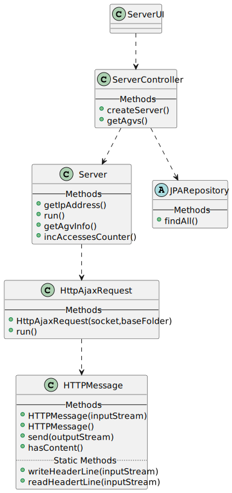
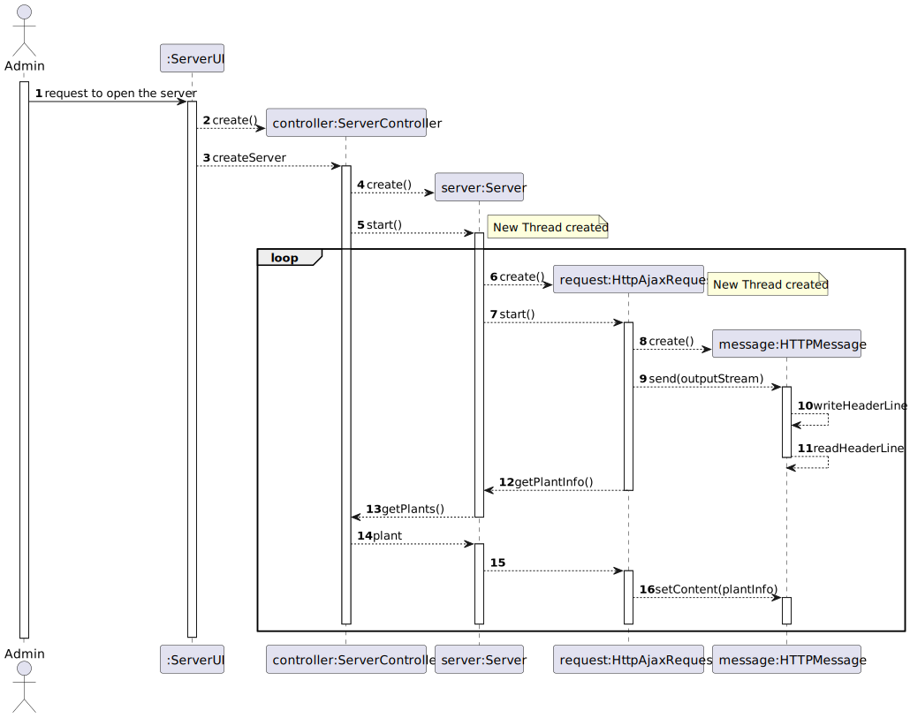

# US2005- HTTP Server
=======================================

# 1. Analysis

## 1.1. User Story Description and Interpretation

#### Description:

> As Warehouse Employee, I want to open a web dashboard presenting the current status of the AGVs as well as their position in the warehouse layout and keeps updated automatically (e.g.: at each minute).

#### Acceptance Criteria

> It must be used the provided application protocol (SPOMS2022). 
>   
> The dashboard is intended to be displayed on a web page provided by an existing HTTP server in the "BackOfficeApp" application and only available to localhost.
>   
>The dashboard web page is kept updated without reloading.
## 1.2. Client Clarifications

### From Document

* >So, a dashboard presenting the (current) status of the AGVs as well as their position in the warehouse is envisioned.

* >Monitoring the warehouse status. It aims presenting a dashboard graphically depicting the layout of the warehouse as well as the location and status of the AGVs. This dashboard must keep updated automatically (e.g.: at every 5 seconds). The updating time must be configured at deployment time.
  
* >A warehouse can be thought as a matrix where each cell represents a small portion of the warehouse (i.e., a square) that has relevance for the warehouse structure (e.g., aisles location) and, therefore, also for its graphical representation as depicted in Figure 8. A similar representation it is intended to get on the dashboard will present the AGVs position in the warehouse.

### From Forum

* > **Q:** How would you like the dashboard to look? A simple list of the AGVS along with its position and status?
  >   
  > **A:** No! Preferably, the dashboard should be an approximation to what is depicted on Figure 8 of the specifications document.
  >  [Link to forum](https://moodle.isep.ipp.pt/mod/forum/discuss.php?d=16277#p20891)

* > **Q:** Our question is, between what applications should the SPOMS protocol be implemented? Should the HTTP server be part of the "BackOfficeApp" and communicate with the AGV Manager using the REQUESTS_API? Or should the HTTP server be its own application and communicate only with the "BackOfficeApp", which on the other hand communicates directly with the database?
  >   
  > **A:**  As it is being said the "HTTP Server" is part of the "Backoffice Application" in order to provide a local web page only. As so, the "HTTP Server" is a component of the "Backoffice Application". 
  >   
  >However, a question stands out: where the data to be presented by the "HTTP server" comes from?
  >   
  >The "backoffice Application" (or one of its components) must, somehow, get the data from the "AGV Manager" (and/or the system database).
  >   
  >In addition, you should notice that the SPOMS2002 protocol relies on the TCP and not on HTTP.
  >   
  >There is nothing wrong here.
  >   
  >If you still having doubts, I advice you to talk with technical support (in this case, preferably RCOMP lab teachers).  
  >  [Link to forum](https://moodle.isep.ipp.pt/mod/forum/discuss.php?d=16700#p21428)

## 2. Design

### 2.1. Design

## 3. Annotations

To "simulate" the AGV movements for the momment, a Thread called 'UpdateAGVsThread' was created and is just being used for Sprint C demonstrations. Afterwards, this class shall be removed.