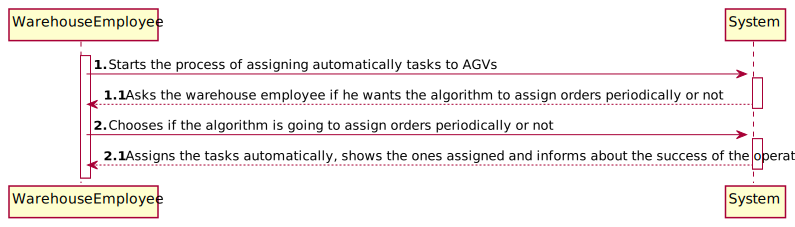
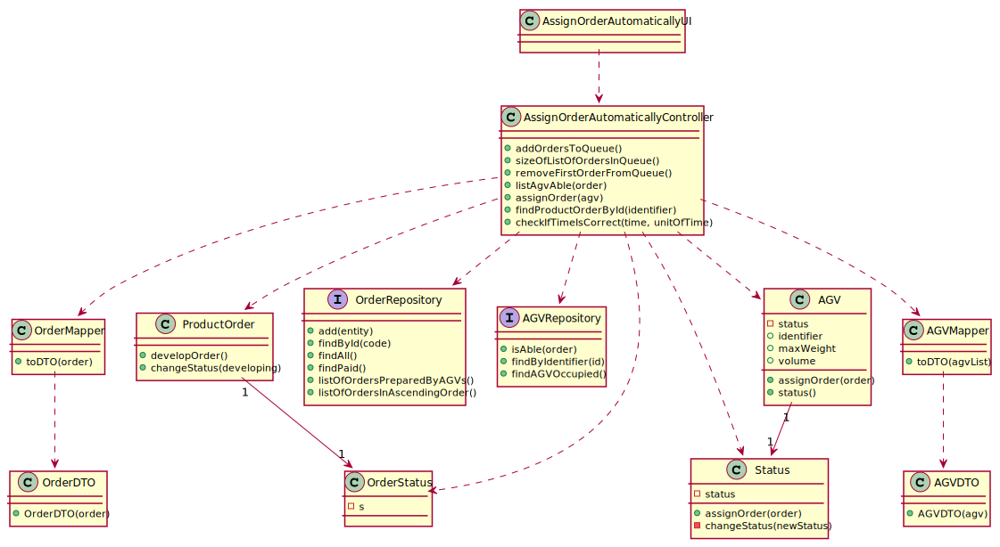
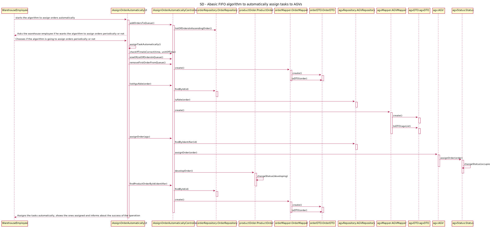

# US4002 - Implement a basic FIFO algorithm to automatically assign tasks to AGVs
=======================================

# 1. Requirements

## 1.1. User Story Description and Interpretation

#### Description:

> As Project Manager, I want that the "AGVManager" component is enhanced with a basic FIFO algorithm to automatically assign tasks to AGVs.

#### Acceptance Criteria

> None.

## 1.2. Client Clarifications

### From Document

* > Any order that is in the state "<u>Paid</u>" is an order that can be assigned to an AGV. 

 

* > It is mandatory to implement a <u>FIFO algorithm</u>.

 

### From Forum

* > **Q:** Will the FIFO algorithm be used to control the tasks/orders that are waiting for an available AGV? If I am interpreting something wrong please clarify for me.
  >   
  > **A:** The general idea is that product orders reaching a certain state whose meaning is of "need to be prepared by an AGV" are added to a queue. Then, following the FIFO algorithm orders are removed from the queue and assigned to available AGVs capable of performing the task that such order implies.
  >  [Link to forum](https://moodle.isep.ipp.pt/mod/forum/discuss.php?d=16326)

* > **Q:** Talking about being automatic, the System executes this functionally after some other functionality, or executes it periodically? If it is periodically, how often?
  >   
  > **A:** Teams are free to propose a solution for that problem/issue. Notice that all team decisions must be well supported in light of business need and technical constraints.
  >  [Link to forum](https://moodle.isep.ipp.pt/mod/forum/discuss.php?d=16326)

* > **Q:** In US4002 it is required that the AGV Manager should support automatic assignment of orders to AGVs. In US2003 the Warehouse Employee will be able to assign any order to an AGV available. If the orders are being automatically assigned to an AGV (US4002) how can the Warehouse Employee assign a specific order to an AGV?
  >   
  > **A:** Usually, and by default, one intends that system automatically assigns orders to AGVs (US 4002).
  >   
  > However, if such option is not available (e.g.: turned off) or by some reason an order needs to be prepared faster than it would normally be, the warehouse employee has the ability to assign tasks manually (US 2003).
  >   
  > Notice that, orders that can be prepared by AGVs are being added to a queue following a FIFO algorithm (part of the US 4002). In the scope of US 2003 the FIFO algorithm does not apply... the employee might choose the order (s)he wants.
  >  [Link to forum](https://moodle.isep.ipp.pt/mod/forum/discuss.php?d=16394)

# 2. Analysis

*In this section the team should describe the study/analysis/comparison done with the meaning to take the best options
of design for the functionality as well as apply the suited diagrams/artifacts of analysis.*

*It is recommended to organize the content by subsections.*

## 2.1. System Sequence Diagram (SSD)

# 3. Design

*In this section the team should describe the adopted design to satisfy the functionality. Among others, the team should
present the functionality development diagram(s), class diagram(s), identification of patterns applied and which were the
principal tests specified to validate the functionality.*

*Beyond the suggested sections, others can be included.*

## 3.1. Functionality development

*In this section should be presented and described the flow/sequence that allows to run the functionality.*

To execute this user story the following steps are required:
- Login as "warehouse employee"
- Select "Options"
- Select "Assign order automatically to an AGV"
- Select on of the options: "Not periodically" or "Periodically"
- If the option "Periodically" is selected: enter the time interval

## 3.2. Class Diagram

*In this section should be presented and described the main classes involved in the functionality development.*

## 3.3. Sequence Diagram

## 3.4. Applied patterns

*In this section show be presented and explained which were the design patterns applied and the best practices.*

The following design patterns were used in this user story:
- Mapper
- DTO

## 4. Annotations

As a team, it was chosen that, in order to be able to observe the operation of the User Story, the Warehouse Employee 
would be given options to see the automatic assignment of orders to the AGV.

Thus, the Warehouse Employee has the options of:

* Automatic assignment of the first order in the queue;
* Choosing a time interval between assigning orders to AGVs.

In the first option, orders whose status is "Paid" enter the queue in ascending order of their insertion date. 
After choosing this option, the first order leaves the queue and is shown to the Warehouse Employee. 

In the second option, the Warehouse Employee enters the time interval that (s)he wants for the orders to be output from 
the queue and these are shown in the order of output to this same Warehouse Employee. 

Confirmations/Verifications:

* Checks if there is an entry of orders in the queue;
* Checks that the order removed from the queue is not null;
* Checks for available AGVs;
* Checks if the chosen AGV is not null;
* Checks if the order is assigned to the AGV;
* Checks if the time range is valid and within the format.

The use of events was thought of but not implemented. Once orders are paid, they are added to a queue that automatically 
assigns them to an AGV as soon as it becomes free. Thus, the Warehouse Employee does not need to be notified.

In fact, as there is no state prior to adding orders to the queue (example: "TO_BE_PREPARED"), the Warehouse Employee does 
not need to be informed about a certain order that has been paid and put on hold. Thus, the use of events was excluded. 