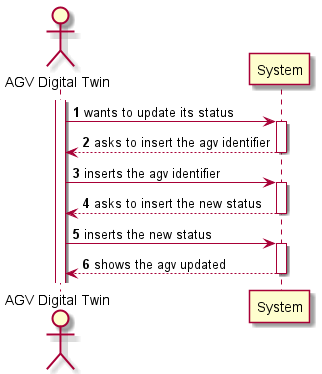
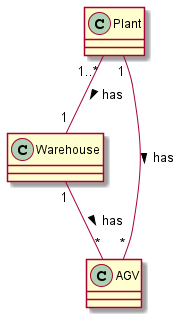
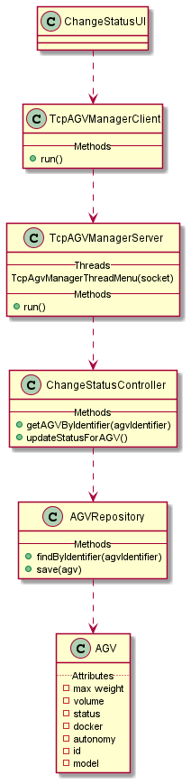
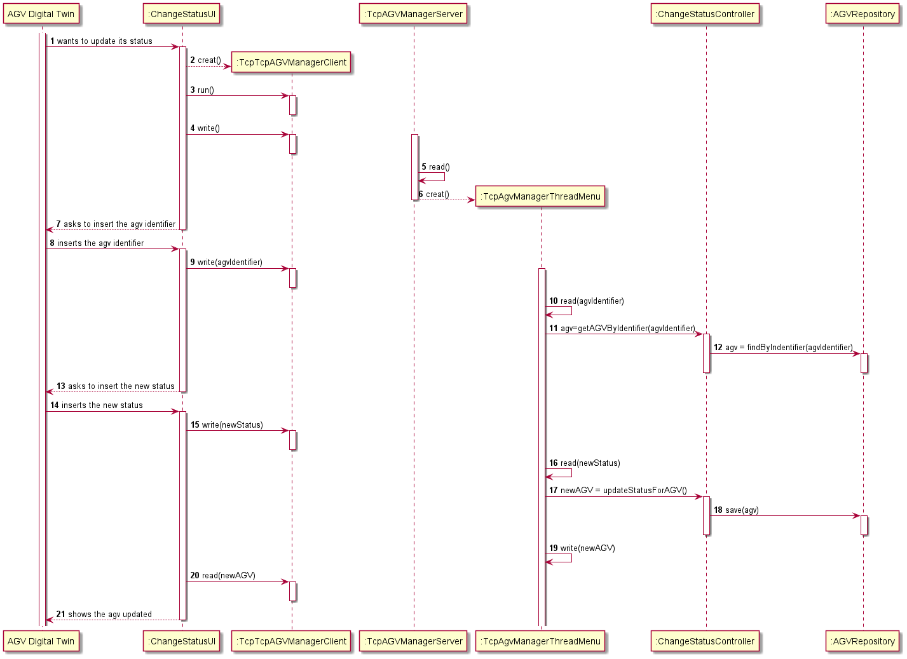

# US5002
=======================================

# 1. Requirements

#### Description:

> As Project Manager, I want that the team start developing the output communication module of the AGV digital twin to update its status on the "AGVManager".

###### Acceptance Criteria:

> It must be used the provided application protocol (SPOMS2022). It is suggested the adoptiong of concurrent mechanisms (e.g. threads) and state sharing between these mechanisms. In this sprint, for demonstration purposes, it is acceptable to mock processing some of the incoming requests to foster some output communication.

### Project Clarifications:

* > Concerning AGVs, during this project, there is the aim of developing an AGV digital twin in two consecutive phases:
  > First, at an initial phase, it is only necessary to address the interactions regarding tasks acceptance and its completion by mocking somehow the process of picking up products and moving through the warehouse. 
  > Further, at a later phase, there is the aim to evolve the digital twin to address (by simulation) the challenges (e.g.: avoiding obstacles) brought by having several AGVs moving simultaneously in the warehouse.

  
* > An application, called “AGV Digital Twin” able to mimic the general behavior of a real AGV. Among
  other things, it should (i) accept tasks to collect a set of products, (ii) report task completion, and
  (iii) simulate being moving through the warehouse to pick up products.

* > It is foreseen that multiple instances of the “AGV Digital Twin” are running simultaneously (but with
  distinct configurations) to simulate the existence of several AGVs on the warehouse.
  
* > This section presents some tips/guidelines for the AGV Digital Twin development, namely its
  decomposition in several sub-components/modules. Accordingly, at least seven distinct modules are
  being foreseen:
    
  > Communications: responsible for receiving/sending information from/to other external
  components such as the “AGV Manager” (cf. Figure 2). For instance, it can receive the warehouse
  plant, the location of the other AGVs as well as the command to pick-up some product(s). On other
  hand, it can send information about its current location, status and so on.
    
  

  
### Client Clarifications:

* > **Q:**
  > What type of communication do you want, i.e., what are the communications that you want to have between these two. Like AGV Manager says "Take a product" and AGV Digital Twin says "Taken"? Is it something like that? Or am i confused?
    
  > **A:**
  >The communication must follow the SPOMS2022 protocol.

  >It is up to you and your team to devise a set of messages fulfilling the business requirements properly.
  >  [Link to forum](https://moodle.isep.ipp.pt/mod/forum/discuss.php?d=16593#p21287)

# 2. Analysis

*In this section the team should describe the study/analysis/comparison done with the meaning to take the best options
of design for the functionality as well as apply the suited diagrams/artifacts of analysis.*

*It is recommended to organize the content by subsections.*

# 3. Design

*In this section the team should describe the adopted design to satisfy the functionality. Among others, the team should
present the functionality development diagram(s), class diagram(s), identification of patterns applied and which were
the principal tests specified to validate the functionality.*

*Beyond the suggested sections, others can be included.*

## 3.1. Functionality development

*In this section should be presented and described the flow/sequence that allows to run the functionality.*

## 3.2. Class Diagram

*In this section should be presented and described the main classes involved in the functionality development.*

## 3.3. Applied patterns

*In this section show be presented and explained which were the design patterns applied and the best practices.*

## 3.4. Tests

*In this section should be systemized how the tests were developed to allow a correct way to scout the requirement
satisfaction.*

**Test 1:** Bla Bla Bla

	@Test(expected = IllegalArgumentException.class)
		public void ensureNullIsNotAllowed() {
		Exemplo instance = new Exemplo(null, null);
	}

# 4. Implementation

*In this section the team show provide, if necessary, some evidence that the implementation is in accordance with the
design developed. Beyond that, show be mentioned/described the existence of any other relevant file (e.g. configuration)
e highlight relevant commits.*

*It is recommended to organize this content in subsections.*

# 5. Integration/Demonstration

*In this section the team should describe the efforts made to integrate the developed functionality with the remaining
functionality of the system.*

# 6. Observations

*In this section is suggested to present a critic view about the pointed developed work, for example, other ways and/or
future works related.*