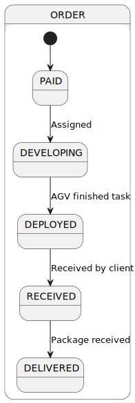

# README - Sprint C

## 1. Group Members

| Number  |        Name        |
|:-------:|:------------------:|
| 1190827 |    Luís Araújo     |
| 1201180 | Guilherme Sencadas |
| 1201216 |  Lucas Guimarães   |
| 1201217 |    Marco Ramos     |
| 1201228 |   Ana RIta Silva   |

## 2. Tasks

### 2.1 Task Division

| Task Number |                                                                                 Description                                                                                  |
|:-----------:|:----------------------------------------------------------------------------------------------------------------------------------------------------------------------------:|
|    3002     |                                    *As **SalesManager**, I want to get a statistical report regarding a previously set up questionnaire.*                                    |
|    3501     |            *As **Customer**, I want to get the list of questionnaires that the system is asking me to answer and be able to answer any of those questionnaires.*             |
|    4003     |                     *As **ProjectManager**,  I want the communications (of the AGVManager) made through the SPOMS2022 protocol to be secured/protected.*                     |
|    5003     |               *As **ProjectManager**, I want the input communications (of the AGV Digital Twin) made through the SPOMS2022 protocol to be secured/protected.*                |
|    5004     |              *As **Project Manager**, I want the output communications  (of the AGV Digital Twin) made through the SPOMS2022 protocol to be secured/protected.*              |
|    5100     | *As **ProjectManager**, I want that the team to develop and integrate the others components/parts of the AGV digital twin (e.g.: movement, obstacle sensors, control unit).* |
|    9002     |                                                                      *As **Software Product Client**, *                                                                      |
|    1006     |   *As **SalesClerk**, I want to access a list of orders that had been dispatched for customer delivery and be able to update some of those orders to as being delivered.*    |
|    2006     |                               *As **ProjectManager**, I want the communications made through the SPOMS2022 protocol to be secured/protected.*                                |
|    1502     |                                                    *As **Customer**, I want to view/check the status of my open orders.*                                                     |
|    1902     |                               *As **ProjectManager**, I want the communications made through the SPOMS2022 protocol to be secured/protected.*                                |

### 1.2 Task Attribution

|       Task Number        | Member  |    Member Name     |     User      |
|:------------------------:|:-------:|:------------------:|:-------------:|
| [3002](US3002/US3002.md) | 1190827 |    Luís Araújo     | sales_manager |
| [3501](US3501/US3501.md) | 1201180 | Guilherme Sencadas |   customer    |
| [4003](US4003/US4003.md) | 1201228 |   Ana Rita Silva   |      ---      |
| [5003](US5003/US5003.md) | 1201216 |  Lucas Guimarães   |      ---      |
| [5004](US5004/US5004.md) | 1201217 |    Marco Ramos     |      ---      |
| [5100](US5100/US5100.md) | 1201228 |   Ana Rita Silva   |      ---      |
| [9002](US9002/US9002.md) | 1201180 | Guilherme Sencadas |      ---      |
| [1006](US1006/US1006.md) | 1190827 |    Luís Araújo     |  sales_clerk  |
| [2006](US2006/US2006.md) | 1201180 | Guilherme Sencadas |      ---      |
| [1502](US1502/US1502.md) | 1201217 |    Marco Ramos     |   customer    |
| [1902](US1902/US1902.md) | 1201216 |  Lucas Guimarães   |      ---      |

## 3. Documentation

### 3.1 Domain Model

### 3.2 SPOMS Protocol

|   Field    | Offset | Length |                                                                                                                                                         Description                                                                                                                                                          |
|:----------:|:------:|:------:|:----------------------------------------------------------------------------------------------------------------------------------------------------------------------------------------------------------------------------------------------------------------------------------------------------------------------------:|
|  Version   |   0    |   1    |                                                                          SPOMSP message format version. This field is a single byte and should be interpreted as an unsigned integer (0 to 255). The present message format version number is one.                                                                           |
|    Code    |   1    |   1    |                                                                                                      This field identifies the type of request or response. It should be interpreted as an unsigned integer (0 to 255).                                                                                                      |
| D_LENGTH_1 |   2    |   1    | These two fields are used to specify the length in bytes of the DATA field. Both these fields are to be interpreted as unsigned integer numbers (0 to 255). The length of the DATA field is to be calculated as follows: D_LENGTH_1 + 256 x D_LENGTH_2. The length of the DATA field may be zero, meaning it does not exist. |
| D_LENGTH_2 |   3    |   1    | These two fields are used to specify the length in bytes of the DATA field. Both these fields are to be interpreted as unsigned integer numbers (0 to 255). The length of the DATA field is to be calculated as follows: D_LENGTH_1 + 256 x D_LENGTH_2. The length of the DATA field may be zero, meaning it does not exist. |
|    DATA    |   4    |   -    |                                                                                                                         Contains data to meet the specific needs of the participating applications.                                                                                                                          |

| Code | Meaning                                                                                                                                                                                                |
|:----:|--------------------------------------------------------------------------------------------------------------------------------------------------------------------------------------------------------|
|  0   | COMMTEST - Communications test request with no other effect on the server application than the response with a code two message (ACK). This request has no data.                                       |
|  1   | DISCONN - End of session request. The server is supposed to respond with a code two message, afterwards both applications are expected to close the session (TCP connection). This request has no data |
|  2   | ACK - Generic acknowledgment message. Used in response to requests with codes zero and one but may be used for other requests. This response has no data.                                              |
|  3   | US1501 - Add a Product to the Shopping Cart                                                                                                                                                            |
|  4   | US2003 - Ask/force an order to be immediately prepared by an AGV available.                                                                                                                            |
|  5   | US4002 - Automatically assign tasks to AGVs                                                                                                                                                            |
|  6   | US2002 - Configure the AGVs available                                                                                                                                                                  |
|  7   | US5002 - Change AGV status                                                                                                                                                                             |
|  8   | US1502 - View/check the status of my open orders.                                                                                                                                                      |
|  9   | US5100 - Calling the movement thread                                                                                                                                                                   |
|  10  | US5100 - Calling the digital twin Thread                                                                                                                                                               |
|  11  | US5100 - Battery Update                                                                                                                                                                                |
|  12  | US5100 - AGV Movement                                                                                                                                                                                  |
|  13  | US5100 - AGV Sensors                                                                                                                                                                                   |

### 3.3 State Diagrams

* AGV State Diagram

* Order State Diagram

## 4 Functional Tests

###US1006

**User:** Sales_clerk

-----------------  Access a list of orders that had been dispatched for customer delivery and be able to update some of those orders to as being delivered -------------------

|  Input  |                         Input                            |
|:-------:|:--------------------------------------------------------:|
| Console |                Login (warehouse_employee)                |
| Console |                       2. Options                         |
| Console |                 4. Assign order to an AGV                |
| Console |                           1                              |
| Console |                           1                              |
| Console |                       2. Options                         |
| Console |    3. Update order to dispatched for customer delivery   |
| Console |                           1                              |
| Console |                           1                              |
| Console |                     1. My account                        |
| Console |                        3. Logout                         |
| Console |                     1. My account                        |
| Console |                        2. Login                          |
| Console |                     Login (sales_clerk)                  |
| Console |                       2. Options                         |
| Console |         6. Update order to as being delivered            |
| Console |                           1                              |

###US3002

**User:** Sales_manager

-----------------  Get a statistical report regarding a previously set up questionnaire -------------------

|  Input  |                         Input                            |
|:-------:|:--------------------------------------------------------:|
| Console |                Login (sales_manager)                     |
| Console |                       2. Options                         |
| Console |                      3. See Report                       |
| Console |                  1. Generate a report                    |
| Console |                          1                               |
| Console |                          1                               |
| Console |                      24-02-2021                          |
| Console |                      25-02-2021                          |

###US3501

**User:** Customer

|     Input     |                                Input                                 |
|:-------------:|:--------------------------------------------------------------------:|
| File Explorer |                  Delete if exist file "emails.txt"                   |
|    Console    |                            Run Bootstrap                             |
| File Explorer |                     Open new filew "emails.txt"                      |
|     Text      |                             See contents                             |
|    Console    |                          Login(MarcoRamos)                           |
|    Console    |                              2.Options                               |
|    Console    |                          2. Export a Survey                          |
|    Console    |                                  4                                   |
|     Text      |                       Edit file and answer it                        | 
|    Console    |                              2.Options                               |
|    Console    |                           3. Answer Survey                           |
|    Console    | Type the file name  *(To show errors use testX-survey.txt files)* |
