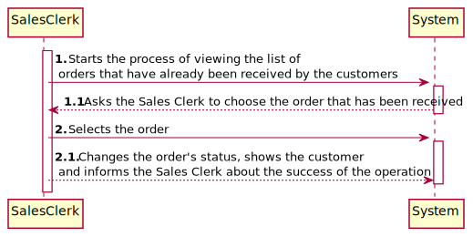

# US2004 - Access a list of orders that had been dispatched for customer delivery and be able to update some of those orders to as being delivered.
=======================================

# 1. Requirements

## 1.1. User Story Description and Interpretation

#### Description:

> As Sales Clerk, I want to access a list of orders that had been dispatched for customer delivery and be able to update some of those orders to as being delivered.

#### Acceptance Criteria

> None.

## 1.2. Client Clarifications

### From Document

* > An order must be in the "<u>received</u>" state.

 

* > The sales clerk <u>chooses</u> one of the orders.

 

* > An event <u>informs the sales clerk that an order was received by the customer</u>.

 

### From Forum

* > **Q:** For this US, the information to present to the Sales Clerk should be different than the information shown to the Warehouse Employee in a similar US or should it have the same information fields?
  >   
  > **A:** I would say that some fields might be the same (e.g. order id, date, customer) and differ on others.
  > For instance, within this US the dispatching' date seems to be an important information.
  >  [Link to forum](https://moodle.isep.ipp.pt/mod/forum/discuss.php?d=16814)

* > **Q:** Adding to that, and following the "Warehouse Management" instructions on page 7 and 8, it seems the system never 
  > really is made aware of the changes to (v) ready for packaging and (vi) ready for carrier dispatching. Would it 
  > be prudent to remove them from the system as state options or not? (this would make it so, the sales clerk 
  > would actually change the state from "dispatched for customer delivery" to "being delivered", instead of taking 
  > it from "Ready for dispatching". To end, what property would be of interest for the sales clerk for the orders to be sorted by?
  >   
  > **A:** Remember also what is stated on page 7: "At this time, the order status should change from “being prepared” 
  > (set when the AGV accepted the task) to “ready for packaging”.
  >   It is not prudent to neglect states even if such states are not being exploit at the moment.
  > You might sort the orders from the older ones to the new ones considering the date/time of their status.
  >  [Link to forum](https://moodle.isep.ipp.pt/mod/forum/search.php?id=2760&search=us1006)

# 2. Analysis

*In this section the team should describe the study/analysis/comparison done with the meaning to take the best options
of design for the functionality as well as apply the suited diagrams/artifacts of analysis.*

*It is recommended to organize the content by subsections.*

## 2.1. System Sequence Diagram (SSD)

# 3. Design

*In this section the team should describe the adopted design to satisfy the functionality. Among others, the team should
present the functionality development diagram(s), class diagram(s), identification of patterns applied and which were the
principal tests specified to validate the functionality.*

*Beyond the suggested sections, others can be included.*

## 3.1. Functionality development

*In this section should be presented and described the flow/sequence that allows to run the functionality.*

To execute this user story the following steps are required:
- Login as "sales clerk"
- Select "Options"
- Select "Update order to as being delivered"
- Select the intended order that has been received by the customer

## 3.2. Class Diagram

*In this section should be presented and described the main classes involved in the functionality development.*

## 3.3. Sequence Diagram

## 3.4. Applied patterns

*In this section show be presented and explained which were the design patterns applied and the best practices.*

The following design patterns were used in this user story:
- Mapper
- DTO
- Event
- Watchdog

## 4. Annotations

For the operation of this User Story, the patterns of events and watchdogs were used. Due to the lack of a 
status of an order it was agreed by the group to add a status "Received". For the proper functioning of this 
User Story, after an order is dispatched to the customer, a message is shown from an event and a watchdog 
that an order has been received by the customer. After this, Sales Clerk can choose one of the orders in 
the "Received" status list to change the status to "Delivered".

Confirmations/Verifications:

* Checks if there are any orders with the status "Received";
* Checks if the status was correctly changed to "Delivered".