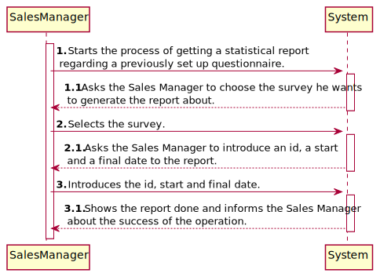
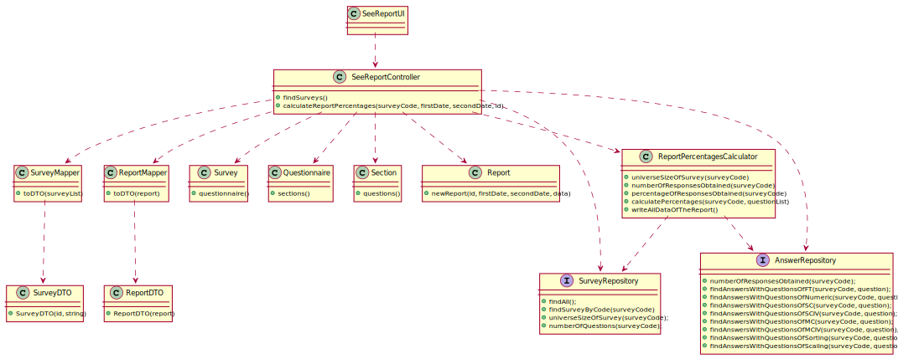
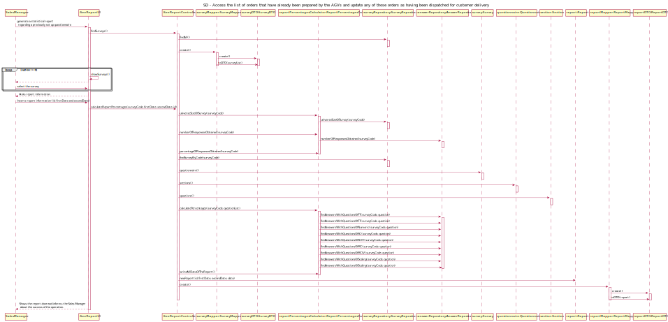

# US3002 - Get a statistical report regarding a previously set up questionnaire.
=======================================

# 1. Requirements

## 1.1. User Story Description and Interpretation

#### Description:

> As Sales Manager, I want to get a statistical report regarding a previously set up questionnaire.

#### Acceptance Criteria

> Again, notice that the report should be generated considering the given questionnaire and the set of answers obtained until the current moment.

## 1.2. Client Clarifications

### From Document

* > Report must be <u>statistical<u/>.

 

* > The warehouse employee <u>chooses</u> a survey to do the report.

 

### From Forum

* > **Q:** For this US, what are the types of statistical report that Sales Clerk want to see?
  >   
  > **A:** Any report must have the basic:
  >   Universe Size (implies knowing the amount of users the survey was distributed to);
  >   Number of Responses Obtained
  >   % of responses obtained;
  >    Further, something depending on the question type:
  >   For “Single-Choice” questions:
  >   Distribution (in %) of responses for each alternative (e.g.: A = 30%, B = 27%, C = 40%, Others = 3%)
  >    For “Multiple-Choice” questions:
  >   Distribution (in %) of responses for each alternative (e.g.: A = 30%, B = 27%, C = 40%, Others = 3%)
  >   Distribution (in %) of combined responses (e.g.: A+B = 15%, A+C = 100%, B+C=100%, A+B+C=10%)
  >    For “Sorting-Options” questions:
  >   Distribution of the various hypotheses for each position (e.g.: 1st Place = A(40%) B (60%) C(0%); 2nd Place = A(50%) B(40%) C(10%); 3rd Place =A(10%) C(90%))
  >    For “Scaling-Options” questions:
  >   Distribution of each option by scale levels.
  >  [Link to forum](https://moodle.isep.ipp.pt/mod/forum/discuss.php?d=16825)

* > **Q:** For this US, does the statistical report need to be shown to the SalesClerk or needs to be saved in some file too (p.e. text file)?
  >   
  > **A:** The important is to show the statistical report.
  >    Saving the report is not seen as relevant since, at any time, the user might request to see the report 
  > again. Notice that the information on which the report is computed is already persisted on the system.
  >  [Link to forum](https://moodle.isep.ipp.pt/mod/forum/discuss.php?d=16836)

# 2. Analysis

*In this section the team should describe the study/analysis/comparison done with the meaning to take the best options
of design for the functionality as well as apply the suited diagrams/artifacts of analysis.*

*It is recommended to organize the content by subsections.*

## 2.1. System Sequence Diagram (SSD)

# 3. Design

*In this section the team should describe the adopted design to satisfy the functionality. Among others, the team should
present the functionality development diagram(s), class diagram(s), identification of patterns applied and which were the
principal tests specified to validate the functionality.*

*Beyond the suggested sections, others can be included.*

## 3.1. Functionality development

*In this section should be presented and described the flow/sequence that allows to run the functionality.*

To execute this user story the following steps are required:
- Login as "sales manager"
- Select "Options"
- Select "See Report"
- Select the intended survey
- Insert the id, first and second date of the report

## 3.2. Class Diagram

*In this section should be presented and described the main classes involved in the functionality development.*

## 3.3. Sequence Diagram

## 3.4. Applied patterns

*In this section show be presented and explained which were the design patterns applied and the best practices.*

The following design patterns were used in this user story:
- Mapper
- DTO

## 4. Annotations

For this User Story, the "Report" class created was not persisted in the database as explained in the forum. 
The report can be generated at any time about any survey with a questionnaire. 
An auxiliary class was created that works as a calculator for all the percentages and accounts needed for the report.
Although the report is not persisted, it was assigned an id and 2 dates.

Confirmations/Verifications:

* Checks if the option chosen to generate a report is valid.
* Checks if there are surveys available.
* Checks if the option chosen to choose a survey is valid.
* Checks if both dates are in the right format.