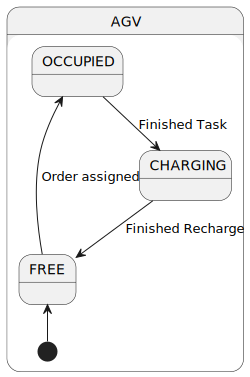
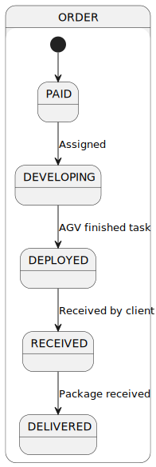
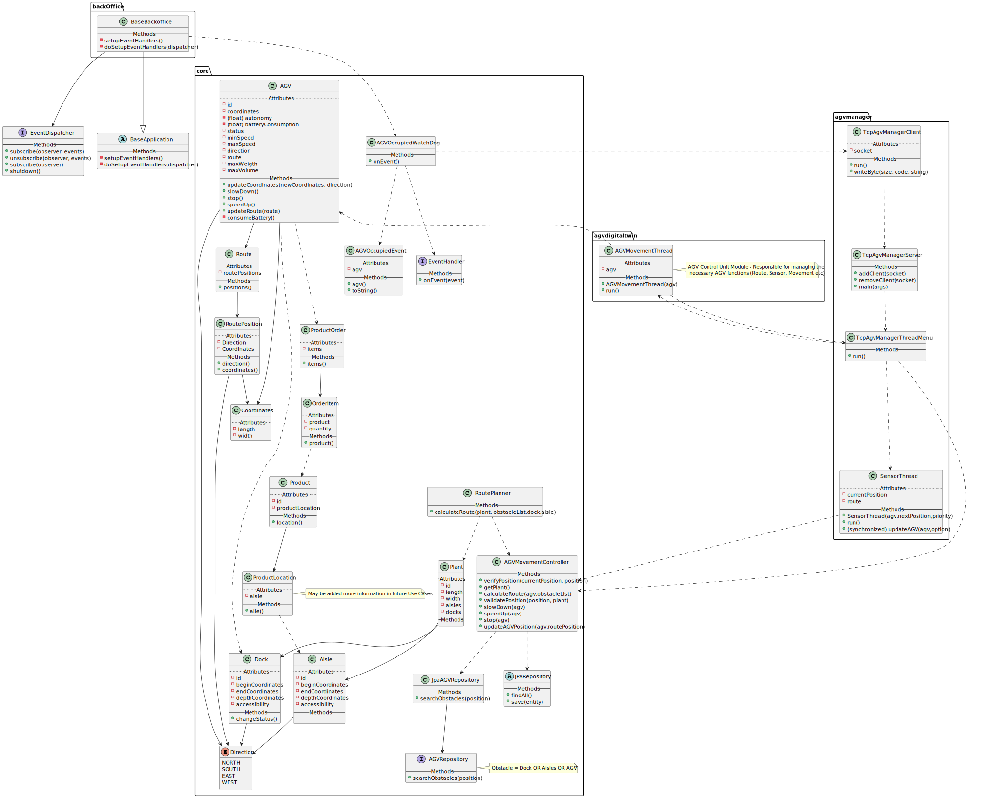
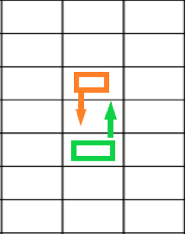
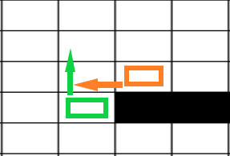
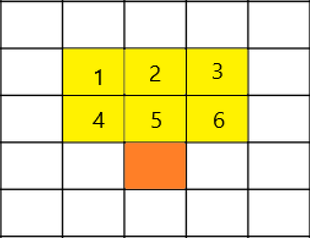

US5100
=======================================

# 1. Requirements

*In this section the team should indicate the developed functionality as well as describe its interpretation and its
correlation and/or dependency of/with others requirements.*

## 1.1. User Story Description and Interpretation

**US5100:** “As Warehouse Employee, I want to access the list of orders that need to be prepared by an AGV and be able
to ask/force any of those orders to be immediately prepared by an AGV available.“

## 1.2. Forum Clarifications

>- **Question**:
>  - Question 1: Could you specify how the speed of an AGV is determined, seeing that we do not know the maximum
>  speed of the AGV?
>  - Question 2: At what charge do you suppose the AGV should move to the AGV docker to charge?
>  - Question 3: How should we measure the charging of an AGV should it have a certain percentage per minute or per hour?
>  - Question 4: Could you specify at what percentage the discharging of the AGV happens and if it is affected by other factors other
>    than being turned on?
>  - Question 5: It is mentioned that when the AGV detects an obstacle 2 squares away it should reduce its velocity, could you please quantify the reduction.
>     
>     
>- **Answer**: You have to notice that the overall idea is to simulate a real AGV. As so, you might start by applying
>  basic algorithms for every AGV functions (e.g.: moving, charging/discharging battery). Probably, you might need
>  some input information to apply such algorithms (e.g.: min, max and average speed). Such information might vary
>  from one AGV to another, for instance, based on the AGV model.
>  - Q1: If you need such information, you should
>    collect such information previously (e.g.: US 2002).
>  - Q2: Again, such value might be configurable by AGV (model). 
>  - Q3: You should adopt "seconds" as time unit.
>  - Q4: As stated on the specifications' document: "when the AGV is moving battery consumption might be computed based on the travelled distance, but when the AGV is waiting/stopped
>  on its dock battery consumption might be computed based on time. Other factors might be considered, but at this stage, I recommend you to not apply a complex algorithm.
>  - Q5: It is up to you decide that. However, notice that the idea is to avoid collision. Yet, about this subject here are some additional hints:
>    Choose a speed that allows to see the movement of the AGV on the screen; You should define your charging and discharging model. 
>  A simplified linear model is perfectly adequate for the problem. Define your charging and
>    discharging parameters according to your model.
>
>      [Link 1](https://moodle.isep.ipp.pt/mod/forum/discuss.php?d=16966#p21741)

>- **Question**:
>  - Q1: On the SPOMS Communications Protocol document, it says that an AGVDigitalTwin is both a server and
>    client application. Since it communicates with the AGVManager, does it mean that the AGV Manager is both client and
>    server as well, or should the requests to the Digital Twin be sent as server?
>  - Q2: On this question [Link 2.1](https://moodle.isep.ipp.pt/mod/forum/discuss.php?d=16394) regarding the relationship between
>    US2003 and 4002, you said “However, if such option is not available (e.g.: turned off) or by some reason an order
>    needs to be prepared faster than it would normally be, the warehouse employee has the ability to assign tasks
>    manually (US 2003)”. When you say that the option is turned off, do you mean the AGV Manager as a whole, or just the
>    FIFO algorithm?
>  - Q3: In case it’s just the option that needs to be turned off, if the warehouse employee wants to force
>    a task onto an AGV, does it need to be through the AGV Manager? And can the BackOffice application get the available
>    AGVs directly with the database, or should it ask the AGVManager for them?
>  - Q4: Also, currently, once we start the AGV Manager server, messages are constantly printed on the console, which makes
>  the usability impossible to turn on or off the FIFO option (in case such does exist). Would you prefer having two instances of the app running, one that acts as
>    a server and other that serves as the FIFO, that can be turned on or off?
>  - Q5: In case that option does not exist, or the manual task assignment is not done through the AGV Manager, how should
>  the digital twin be aware of the newly created task?
>     
>     
>- **Answer**:
>  - Q1: The AGV Manager is both: server and client. As a server, it receives requests from the "BackOffice
>    App"
>    and from the "Digital Twin" and, as client, it sends requests to the "Digital Twin".
>  - Q2: No! The "turned off"means that the algorithm automatically assigning tasks to AGV is not running. But, the "AGV Manager" stills
>    running.
>  - Q3: Your solution must be in conformity with figure 2 of the specifications' document.
>  - Q4: You can turn on/off the FIFO algorithm when starting the AGVManager.
>  - Q5:  Currently, there are two options: (i) manually or (ii) automatically by the FIFO algorithm.
>
>    [Link 2.2](https://moodle.isep.ipp.pt/mod/forum/discuss.php?d=16959#p21734)

>- **Question**: "Referring to the documentation, it is mentioned that the Route Planner module of the AGV Digital twin is
>  responsible for "... (re)computing routes based on a source and target location on the warehouse considering the
>  warehouse plant only. It is worth notifying that AGV can only move horizontally or vertically". What do you mean by
>  source and target location of agv ? We can set agv dock as a starting point but what would be the end point?"
> 
> 
>- **Answer**: "When assigning a task to an AGV, the AGV knows which products to collect, right? So, the source
>  location (starting point) is the position where the AGV is at that moment (as you said, it might be the AGV dock)
>  The target location (end point) might be the location of a product. However, there are other possibilities. For
>  instance, consider the scenario where the AGV has to collect 2 products (say A and B). At least three routes have
>  to be computed:
>  1. From AGV Dock location to the location of product A.
>  2. From location of product A to the location of product B.
>  3. From location of product B to the AGV dock location."
>
>     [Link 3](https://moodle.isep.ipp.pt/mod/forum/discuss.php?d=16858#p21614)

>- **Question**: "The statement says that an AGV has a total of 8 sensors, 2 in each corner of the AGV. Therefore, some doubts have arisen, such as:
> What is the difference between having one or two sensors, in each corner? How do we differentiate between them? Are they in the same position?"
> 
> 
>- **Answer**: "Each sensor is a source of information to signal (or not) the presence of an obstacle (e.g.: another AGV, an aisle, etc.).
> In each corner there is a sensor to evaluate obstacles in the front and another sensor  to evaluate obstacles on the side."
>     [Link 4](https://moodle.isep.ipp.pt/mod/forum/discuss.php?d=17039) 

>- **Question**: 
  >  - Q1: Would all these AGV Digital Twin instances share information about the different modules, to be aware of the presence of other moving agvs? 
  >  - Q2: At the level of representing the movement of agvs on the dashboard, developed in Sprint 3, how would the information about the movement of an agv be sent to the dashboard, for the dashboard to be able to demonstrate?"
  > 
  > 
> - **Answer**: 
>  - Q1: It is NOT foreseen that AGVs communicate between them. However, each AGV can by its own initiative communicate with the AGV Manager.
   > Notice that in your picture this possibility is not depicted. However, this possibility is depicted on Figure 2 of the specifications' document. 
   >  - Q2: Your question is related to data/information flow. Such flow must be in accordance with Figure 2 of the specifications' document. Notice that,
> the dashboard shows the current position of each AGV. If the AGVs position is changing then by refreshing the dashboard is enough to show AGV movement.
   >      [Link 5](https://moodle.isep.ipp.pt/mod/forum/discuss.php?d=17033)

## 1.3. Clarifications

### 1.3.1 Modules

|             Modules             |                                                                 Description                                                                 |
|:-------------------------------:|:-------------------------------------------------------------------------------------------------------------------------------------------:|
|          Control Unit           |                      <li> Represented by AGV Digital Twin's thread.<li>Responsible for managing the remaining modules.                      |
|             Sensor              |                                                       <li> Detects objects and adapts                                                       |
|           Positioning           |                                     <li> Calculates the position based on the AGV speed and direction.                                      |
| Simulation Engine (AGV Manager) | <li> Collects information from all AGVs.<li> Knows the warehouse plant.<li> Transmits info to all sensors. <li> <u>Updates every 100ms.</u> |
|          Route Planner          |                          <li> Computes a route from the Dock to a specific location and back (avoiding obstacles).                          |
|       Battery Management        |                                                            <li> Monitor battery                                                             |

# 2. Design

*In this section the team should describe the adopted design to satisfy the functionality. Among others, the team should
present the functionality development diagram(s), class diagram(s), identification of patterns applied and which were
the principal tests specified to validate the functionality.*

##2.1 State Diagrams

* AGV State Diagram

* Order State Diagram

## 2.2. Class Diagram

*In this section should be presented and described the main classes involved in the functionality development.*

## 2.3. Sequence Diagram

.svg)

.svg)

.svg)

# 3. Implementation

## 3.1. AGV block

* Head to Head:
  * Going in opposite directions
  * Both would stop
  * One needs to update its route
  * The other should wait

* Right side rule:
  * Each AGV should wait until its right side is clear
  * If so it should continue its route

##3.2. AGV movements

* The orange square represents an AGV.
* Each yellow squares represents a sensor. For each sensor will be created a new thread.
* When one of the nearest sensors (4, 5 and 6) detects an obstacle the AGV must stop.
* When one of the furthest sensors (1, 2 and 3) detects an obstacle the AGV must slow down.
* When there are no obstacles the AGV must speed up.
* Each sensor knows its priority (nearest / furthest).

## 3.3. Details
**Memory Loading:**
* Be careful when reading all AGV's positions because they might have been updated in the meantime (synchronized methods or lazy/eager loadings)

**Battery:**
* Each cycle (100ms) consumes battery.
* The battery should recharge at the same rate it is consumed (<i>batteryConsumption</i> per seconds).
* After every assigned order is finished, the agv should wait at the dock and recharge.

**Speed:**
* When the AGV detects an obstacle at a distance of 2 squares the current speed should be cut in half.
* When the AGV doesn't detect any obstacle at a distance of 2 nor 1 squares the current speed should be increased by half the maximum speed, per movement.

**Obstacles:**
* An AGV can only access a given aisle or dock if their directions/accessibility are the same. And the AGV is in the right coordinates.

* Change the dock's and aisle's accessibility following the table:

| JSON | Direction |
|:----:|:---------:|
|  w-  |   South   |
|  w+  |   North   |
|  l-  |   East    |
|  l+  |   West    |

**Main Classes:**

|       Class       |    Module     |                                                                                        Function                                                                                        |
|:-----------------:|:-------------:|:--------------------------------------------------------------------------------------------------------------------------------------------------------------------------------------:|
|   RoutePlanner    | Route Planner | Calculates the best route to reach a given place. **NOTE:** The 'Obstacle List' is only required when the AGV needs to re-calculate its route (ref. 3.1. AGV block - Head to Head). |
|   SensorThread    |    Sensor     |                                                                            Verifies one square per thread.                                                                             |
| AGVMovementThread | Control Unit  |                            Chooses and defines what modules and methods to use.  The 'brain' of the AGV.  Chooses what 'square' each sensor verifies.                            |

# 4. Annotations

* The AGVs' movements can be seen through the web dashboard.
* The technical team defined a route as every movement required to complete the order. (Dock -> Product A -> Product B -> ... -> Dock).
* The technical team discussed whether to verify every 'square' around each AGV, concluding that it would only be meaningful to verify the 'squares' ahead of the current AGV, given that if every AGV follows this process (ref. 3.2. AGV movements) no collisions should happen.

# 5. Testing

| Module |                   Condition                    |             Result              |   State    |
|:------:|:----------------------------------------------:|:-------------------------------:|:----------:|
|  AGV   |       Try to speed up when Speed == MAX        |              Error              | Not tested |
|  AGV   |       Try to slow down when Speed == MIN       |              Error              | Not tested |
|  AGV   |          Try to stop when Speed == 0           |              Error              | Not tested |
|  AGV   |                  Battery < 0                   |              Error              | Not tested |
|  AGV   |                 Battery > MAX                  |              Error              | Not tested |
|  AGV   |               0 < Battery < MAX                |              Pass               | Not tested |
|  AGV   |            Battery Consumption <=0             |              Error              | Not tested |
|  AGV   |        Battery Consumption >= Autonomy         |              Error              | Not tested |
|  AGV   |                 Negative speed                 |              Error              | Not tested |
|  AGV   |             AGV speed = Min speed              |              Pass               | Not tested |
|  AGV   |             AGV speed = Max speed              |              Pass               | Not tested |
|  AGV   | AGV speed > Min speed && AGV speed < Max speed |              Pass               | Not tested |
|  AGV   |             AGV speed > Max speed              |              Error              | Not tested |
| Route  |                      NULL                      |              Error              | Not tested |
| Route  |                     EMPTY                      |              Error              | Not tested |
| Route  |         Goes beyond warehouse's limits         |              Error              | Not tested |
| Route  |              Goes through aisles               |              Error              | Not tested |
| Route  |               Goes through docks               |              Error              | Not tested |
| Sensor |                   AGV = NULL                   |   Error    | Not tested |
| Sensor |              Next Position = NULL              |   Error    | Not tested |
| Sensor |                Priority = NULL                 |   Error    | Not tested |
| Sensor |     Detects an obstacle at 2 square range      |          AGV-Slow Down          | Not tested |
| Sensor |     Detects an obstacle at 1 square range      |            AGV-Stops            | Not tested |
| Sensor |              No obstacle detected              |          AGV-Speeds up          | Not tested |
| Sensor |         Two AGVs blocked on each other         | AGV1-Update route AGV2-Waits | Not tested |
